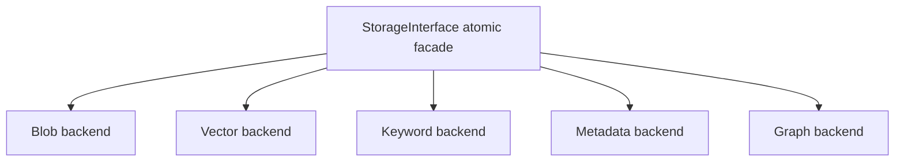
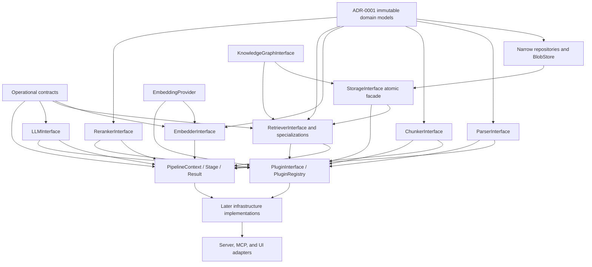

# ADR-0002: Core Interface Contracts

- **Status:** Accepted
- **Date:** 2026-08-07
- **Decision owners:** Mnemo maintainers
- **Scope:** Phase 1, Module 1.2 specification only
- **Depends on:** ADR-0001
- **Related documents:** `mnemo_architecture_v2.md`, `mnemo_engineering_roadmap.md`

## 1. Context

Mnemo's architecture requires replaceable parsers, chunkers, embedding
providers, retrievers, rerankers, language models, and storage backends. The
roadmap assigns their typed contracts to Module 1.2, before any infrastructure
implementation. Later phases also require narrower repositories and operational
coordination contracts so that core pipelines do not depend on database,
transport, or framework classes.

This ADR defines the approved complete version-one public contract surface. It
is a design specification, not an implementation specification for every
contract at once.

Interfaces whose implementation is assigned to later roadmap modules are
specification-only in this ADR and SHALL be implemented only during their
designated roadmap phase.

### 1.1 Module 1.2 implementation boundary

Module 1.2 implements only the contracts explicitly assigned to it by the
engineering roadmap:

- `ParserInterface`;
- `ChunkerInterface`;
- `EmbeddingProvider`, using the approved replacement name for the roadmap's
  provider-level `EmbeddingInterface`;
- `RetrieverInterface`;
- `RerankerInterface`;
- `LLMInterface`;
- `StorageInterface`; and
- their interface version markers and contract value records needed directly
  by those seven contracts.

`EmbedderInterface`, specialized retriever contracts, narrow repositories,
`KnowledgeGraphInterface`, `PluginInterface`, `PluginRegistry`, operational
contracts, and pipeline contracts remain specification-only until their
designated roadmap phases. Their presence in this ADR does not authorize early
implementation.

## 2. Decision goals

The contracts must:

- preserve the four-layer architecture and the knowledge-engine boundary;
- expose domain models from ADR-0001 rather than parallel transfer objects;
- make I/O, ownership, cancellation, concurrency, and failure behavior clear;
- permit built-in and plugin implementations without plugin inheritance;
- keep `mnemo-core` independent of HTTP, FastAPI, Qdrant, SurrealDB, and other
  infrastructure technologies;
- support interface evolution without silently breaking plugins; and
- avoid introducing business behavior into contract definitions.

## 3. Non-goals

This ADR does not:

- implement interfaces, registries, pipelines, storage, or plugins;
- select a database, queue, cache, logger, telemetry exporter, or concurrency
  runtime;
- define REST, WebSocket, MCP, or UI schemas;
- define parsing, chunking, ranking, fusion, graph extraction, or transaction
  algorithms;
- add autonomous actions or external tool invocation to Mnemo; or
- supersede ADR-0001 domain schemas.

## 4. Contract conventions

### 4.1 Versioning and structural conformance

Every contract in this ADR is version 1. Public implementation names will carry
an explicit V1 marker; an unversioned public name may point to the current
version for caller convenience. A breaking signature or semantic change creates
a V2 contract. V1 remains supported for at least two minor releases after V2 is
introduced.

Conformance is structural. Implementations are not required to inherit from a
Mnemo base class. Acceptance tests and static type checking determine whether
an implementation satisfies a contract.

### 4.2 Type vocabulary

This ADR uses ADR-0001 types and models directly. An “immutable sequence” maps
to an immutable ordered collection in the implementation. `Metadata` means
ADR-0001 `FrozenMetadata`. Vectors are immutable sequences of finite floating
point values. Raw files and blobs are bytes.

The following contract records are specified because the architecture already
references equivalent inputs or lifecycle results:

| Record | Required fields | Purpose |
|---|---|---|
| `FileMetadata` | `content_hash: SHA256`, `size_bytes: non-negative integer`, `mime_type: string or null`, `modified_at: Timestamp or null`, `metadata: Metadata` | Caller-known facts supplied to a parser. The filename remains a separate argument. |
| `ChunkingOptions` | `target_tokens: positive integer`, `max_tokens: positive integer`, `overlap_tokens: non-negative integer`, `metadata: Metadata` | Immutable limits supplied to a chunker. `overlap_tokens` must be smaller than `target_tokens`, and `target_tokens` must not exceed `max_tokens`. This is the version-one meaning of the architecture's `ChunkConfig`. |
| `EmbeddingBatch` | `vectors: immutable sequence of vectors`, `model_name: string`, `dimensions: positive integer` | Provider batch output with enough identity to detect dimension/model mismatch. |
| `HealthStatus` | `healthy: boolean`, `component: string`, `detail: string or null`, `checked_at: Timestamp`, `metadata: Metadata` | Transport-independent component health result. |
| `Message` | `role: system, user, or assistant`, `content: string`, `metadata: Metadata` | Input message for `LLMInterface`; it is not a tool-call message. |
| `CompletionResult` | exactly one of `text: string` or `structured: JSONValue`, plus `model: string`, `metadata: Metadata` | Non-streaming language-model result. |
| `CoreEvent` | `event_id: UUID`, `event_type: namespaced string`, `schema_version: positive integer`, `occurred_at: Timestamp`, `payload: Metadata`, `correlation_id: UUID or null` | In-process event-bus payload. |
| `TaskRequest` | `task_type: namespaced string`, `payload: Metadata`, `deduplication_key: string or null`, `priority: integer`, `metadata: Metadata` | Infrastructure-neutral background-work request. |
| `TaskReceipt` | `task_id: UUID`, `accepted_at: Timestamp`, `duplicate_of: UUID or null` | Queue acknowledgement, not task completion. |
| `ClaimedTask` | `task_id: UUID`, `request: TaskRequest`, `lease_token: UUID`, `lease_expires_at: Timestamp`, `attempt: positive integer` | Leased work returned to one queue consumer. |
| `TaskState` | `task_id: UUID`, `status: queued, running, succeeded, failed, or cancelled`, `progress: number from 0 through 1 or null`, `result: Metadata or null`, `error: ErrorRecord or null` | Observable task state. |
| `ProgressUpdate` | `operation_id: UUID`, `stage: string`, `completed: non-negative integer`, `total: non-negative integer or null`, `message: string or null`, `metadata: Metadata` | Monotonic progress observation. |
| `ErrorRecord` | `code: stable namespaced string`, `message: string`, `retryable: boolean`, `details: Metadata` | Serializable failure summary for task and pipeline results. |
| `Page<Item>` | `items: immutable sequence of Item`, `next_cursor: string or null` | Stable repository pagination result. |
| `RegistrationDescriptor` | `capability: string`, `slot: string`, `interface_version: string`, `provider_name: string`, `priority: integer`, `active: boolean` | Immutable registry inspection result; it contains no implementation object. |

These records are part of the approved contract vocabulary, not Module 1.1
domain records. Only records directly required by the Module 1.2 boundary in
section 1.1 may be implemented during Module 1.2.

Capability metadata is immutable and descriptive. Calling `capabilities()`
must not probe infrastructure, perform I/O, mutate configuration, or negotiate
behavior. Capability keys are stable within an interface version. Extra keys
must be namespaced; unknown namespaced keys are ignored by consumers.

### 4.3 Sync and async rule

- Pure, bounded, in-memory work is synchronous: parsing bytes, chunking a parsed
  document, configuration reads, logging calls, progress reporting,
  cancellation inspection, and registry lookup/registration.
- Work that can touch a model provider, storage, filesystem, queue, event
  handler, or another process is asynchronous.
- An asynchronous method must not perform blocking I/O on the event-loop thread.
- Cancellation is cooperative through `CancellationToken`; cancellation of the
  caller's task must also be honored.

Cancellation is part of the public contract but its concrete type and
implementation are intentionally deferred until the roadmap reaches the
operational execution modules. Module 1.2 exposes no cancellation primitives.

### 4.4 Ownership and lifecycle

The composition root creates long-lived infrastructure implementations and
passes them to core services. A component that opens resources exposes
`open()` and `close()`; both are asynchronous and idempotent. `close()` waits for
owned in-flight work or cancels it according to the component's documented
policy. Calling operational methods before `open()` or after `close()` raises a
lifecycle error.

Callers retain ownership of input values. Returned values are immutable or
caller-owned. No contract may retain mutable caller buffers without explicitly
copying them. The registry owns registered component instances after successful
registration but does not own plugin modules.

### 4.5 Concurrency and thread safety

Stateless parser and chunker implementations are safe for concurrent calls.
Long-lived providers, repositories, queues, caches, and retrievers must support
concurrent asynchronous calls within one process. Implementations may use
per-event-loop resources and need not support moving a live instance between
event loops. Synchronous registry mutation is single-threaded during startup;
after the registry is frozen, concurrent lookup is safe.

Pipeline contexts and cancellation tokens may be shared by stages participating
in one operation. Progress callbacks and event handlers must tolerate calls from
concurrent tasks, but implementations must not invoke them from arbitrary OS
threads without documented scheduling back onto the owning event loop.

### 4.6 Error model

Public contracts use a common, implementation-neutral exception taxonomy:

| Error | Meaning |
|---|---|
| `ContractValidationError` | Input violates a contract invariant. Never retry unchanged input. |
| `NotFoundError` | A requested stable identity does not exist. |
| `ConflictError` | Identity, version, priority, or optimistic-state conflict. |
| `UnsupportedError` | Valid input requests an unsupported format or capability. |
| `IntegrityError` | Hash, dimension, graph, citation, or persisted-record integrity failure. |
| `LifecycleError` | Component is unopened, closed, or in an invalid lifecycle transition. |
| `DependencyUnavailableError` | Required local provider or infrastructure dependency is unavailable. |
| `OperationTimeoutError` | Contract deadline expired. May be retryable. |
| `OperationCancelledError` | Cooperative or caller cancellation completed. Never wrap it as a generic failure. |
| `StorageError` | Repository or blob operation failed without exposing vendor exceptions. |
| `PluginError` | Plugin registration or invocation failed at the isolation boundary. |

Exceptions include a stable code, human-readable message, retryability flag,
and immutable details. Vendor exceptions may be retained as internal causes but
must not cross the public boundary. Bulk methods are atomic unless explicitly
documented otherwise; they never return a mixture of success and unreported
failure.

### 4.7 Serialization

Interface instances, cancellation tokens, handlers, loggers, and pipeline
stages are never serialized. ADR-0001 governs domain-model serialization.
Contract records use the same canonical JSON rules and a `schema_version` of 1.
Bytes are not embedded in generic metadata or events. Vectors serialize as JSON
arrays only at an explicit persistence or transport adapter boundary.

No contract accepts or returns HTTP requests, HTTP responses, database records,
Qdrant points, SurrealDB values, or framework-specific exceptions.

### 4.8 Common dependency boundary

All contracts may depend on the standard library, ADR-0001 public models, and
other contracts in this ADR. They must not depend on `mnemo-server`, UI code,
HTTP libraries, FastAPI, Starlette, Qdrant, SurrealDB, SQLite drivers, filesystem
implementations, concrete model-provider clients, or plugin packages.

## 5. Storage contracts

### 5.1 `DocumentRepository`

**Purpose and ownership.** Owns persisted `Document` registry snapshots and
their immutable `DocumentVersion` history. It does not own blob bytes, chunks,
notebook membership, or ingestion orchestration.

| Public method | Inputs | Output | Declared exceptions |
|---|---|---|---|
| `upsert_document` | `document: Document` | none | validation, conflict, integrity, storage |
| `get_document` | `document_id: UUID` | `Document` or null | validation, storage |
| `list_documents` | `status: DocumentStatus or null`, `limit: positive integer`, `cursor: string or null` | page of documents plus next cursor | validation, storage |
| `delete_document` | `document_id: UUID`, `expected_version_id: UUID or null` | boolean indicating whether a record existed | validation, conflict, storage |

All methods are asynchronous. List output is `Page<Document>`. Upsert preserves version history and rejects an
existing identity whose immutable history conflicts. Pagination order and
cursors are stable within a repository implementation. Deletion affects only
the registry record; cross-store cascading belongs to `StorageInterface`.
Implementations must be concurrently safe and must avoid N+1 reads when listing.
Extensions use additive filters or a V2 contract, never backend query objects.

### 5.2 `BlobStore`

**Purpose and ownership.** Owns content-addressed raw bytes, extracted assets,
and serialized parsed intermediate representations. It is the recovery ground
truth described by the storage architecture.

| Public method | Inputs | Output | Declared exceptions |
|---|---|---|---|
| `put_asset` | `data: bytes`, `mime_type: string`, `metadata: Metadata` | `Asset` | validation, integrity, storage |
| `get_asset` | `asset_id: UUID` | bytes or null | validation, integrity, storage |
| `delete_asset` | `asset_id: UUID` | boolean | validation, storage |
| `put_parsed_document` | `version_id: UUID`, `document: ParsedDocument` | none | validation, conflict, integrity, storage |
| `get_parsed_document` | `version_id: UUID` | `ParsedDocument` or null | validation, integrity, storage |
| `contains_hash` | `content_hash: SHA256` | boolean | validation, storage |

Methods are asynchronous and safe for concurrent identical writes. A repeated
write of identical content is idempotent; reuse of an identity for different
content is an integrity error. `put_asset` verifies the content hash represented
by the returned `Asset`. Storage URIs remain opaque and are never dereferenced
outside the owning implementation. Implementations should stream internally
when practical and must not expose filesystem paths as identity.

### 5.3 `NotebookRepository`

**Purpose and ownership.** Owns `Notebook`, `Source`, `Note`, and `Insight`
records. `Source` exclusively owns notebook-to-document membership.

| Public method | Inputs | Output |
|---|---|---|
| `upsert_notebook` / `get_notebook` / `delete_notebook` | notebook snapshot or notebook UUID | none, notebook-or-null, or boolean |
| `list_notebooks` | limit and cursor | stable page plus next cursor |
| `upsert_source` / `get_source` / `delete_source` | source snapshot or source UUID | none, source-or-null, or boolean |
| `list_sources` | notebook UUID, limit, cursor | stable page plus next cursor |
| `upsert_note` / `get_note` / `delete_note` | note snapshot or note UUID | none, note-or-null, or boolean |
| `list_notes` | notebook UUID, limit, cursor | stable page plus next cursor |
| `upsert_insight` / `get_insight` / `delete_insight` | insight snapshot or insight UUID | none, insight-or-null, or boolean |
| `list_insights` | notebook UUID, limit, cursor | stable page plus next cursor |

All list outputs use the corresponding `Page` specialization. All methods are
asynchronous and declare validation, not-found where a required
parent is absent, conflict, integrity, and storage errors as applicable. Writes
must preserve ADR-0001 cross-record ownership rules. Repository deletion does
not silently delete document registry or blob records. The interface is safe
for concurrent notebook operations and is extensible through additive typed
filters, not database predicates.

### 5.4 `ConversationRepository`

**Purpose and ownership.** Owns sessions, append-only turns, and versioned
citations. It does not synthesize answers or invoke language models.

| Public method | Inputs | Output |
|---|---|---|
| `upsert_session` | `session: Session` | none |
| `get_session` | session UUID | session or null |
| `list_sessions` | notebook UUID, limit, cursor | stable page plus next cursor |
| `append_turn` | session UUID, `turn: Turn` | none |
| `list_turns` | session UUID, after-turn UUID or null, limit | ordered turn page plus next cursor |
| `upsert_citation` | `citation: Citation` | none |
| `get_citations_for_turn` | turn UUID | immutable sequence of citations |
| `delete_session` | session UUID | boolean |

List outputs use `Page<Session>` and `Page<Turn>`. Append preserves
chronological order and is idempotent by turn identity.
Citations must reference the cited turn, chunk, document, and document version.
Concurrent appends may not lose or reorder accepted turns. Methods are
asynchronous and use validation, not-found, conflict, integrity, and storage
errors. Pagination must not require loading an entire conversation.

### 5.5 `KnowledgeGraphInterface`

**Purpose and ownership.** Owns entity and edge persistence plus bounded graph
traversal. Entity extraction and normalization algorithms are callers, not part
of this interface.

| Public method | Inputs | Output |
|---|---|---|
| `upsert_entity` | `entity: Entity` | none |
| `upsert_edge` | `edge: GraphEdge` | none |
| `get_entity` | entity UUID | entity or null |
| `find_entities` | canonical name, entity type or null, document UUIDs, limit | immutable sequence of entities |
| `get_related_entities` | entity UUID, positive hop limit, relation filters, result limit | immutable sequence of entities |
| `delete_graph_for_document` | document UUID | none |

All methods are asynchronous. Edge endpoints must exist; aliases participate in
lookup but not entity identity. Traversal is deterministically bounded and must
not expose a vendor query language. Expected implementations include the later
SurrealDB adapter and an in-memory test double. Graph retrieval plugins depend
on this contract, never on the concrete graph store.

### 5.6 `StorageInterface`

**Purpose.** Provides the complete storage facade used by core orchestration.
It is the atomic consistency boundary over blob, document, notebook,
conversation, graph, chunk, vector, and keyword capabilities.

It is one public facade. It does not expose repositories or backend adapters as
public properties. The narrower storage contracts in this ADR describe internal
implementation responsibilities and future injection boundaries; callers that
require atomic multi-store behavior depend only on `StorageInterface`.

`StorageInterface` includes every method of `BlobStore`,
`DocumentRepository`, `NotebookRepository`, `ConversationRepository`, and
`KnowledgeGraphInterface`, plus:

| Public method | Inputs | Output |
|---|---|---|
| `open` / `close` | none | none |
| `health_check` | none | immutable sequence of `HealthStatus` |
| `capabilities` | none | immutable capability metadata |
| `upsert_chunks` | immutable sequence of `Chunk` | none |
| `get_chunk` | chunk SHA-256 identity | chunk or null |
| `delete_chunks_for_document` | document UUID, version UUID or null | none |
| `search_dense` | query vector, `MetadataFilter`, positive `top_k` | immutable sequence of `ScoredChunk` |
| `search_sparse` | non-empty query, `MetadataFilter`, positive `top_k` | immutable sequence of `ScoredChunk` |
| `delete_document_cascade` | document UUID | none |

Bulk upsert and cascade deletion are logical all-or-nothing operations across
configured stores. Results are ordered by descending raw score with deterministic
chunk-ID tie-breaking and contain at most `top_k` unique chunks. The facade
normalizes backend exceptions to the common error model. It is concurrently
safe and should batch backend work; no caller may rely on a concrete storage
engine. `CompositeStorage` is the expected full implementation. Individual
backend adapters are expected to satisfy only the narrow contracts they own and
are assembled behind the facade.

For `upsert_chunks`, atomic replacement is defined over the submitted chunk
identities. A successful call inserts identities that were absent and replaces
the complete stored value of identities that were present; identities omitted
from the batch are untouched. An empty batch is a no-op, repeated identical
upserts are idempotent, and duplicate identities in one batch are invalid. If
the operation fails, every affected identity must have its exact pre-operation
value in every participating store, while identities introduced by the failed
attempt must be absent. Implementations may satisfy this with native
transactions or private affected-key snapshots and compensation. Compensation
must never use document-wide deletion for a failed replacement because that
would destroy valid pre-operation data.

This is a logical operation-level guarantee, not a distributed database
transaction. Qdrant provides no transaction spanning itself and SQLite. A
catastrophic process interruption between backend mutation and completed
compensation can therefore require later reconciliation. Ordinary returned
failures must run exact snapshot restoration; a failed compensation is surfaced
as `StorageError` and logged as potentially consistency-compromising rather than
reported as a successful rollback.

The storage dependency shape is fixed:

Storage capabilities describe configured support for blobs, dense search,
sparse search, metadata records, graph operations, transactions, and health
checks. They never expose vendor names, connections, or clients.

## 6. Ingestion and embedding contracts

### 6.1 `ParserInterface`

**Purpose.** Converts raw bytes into one `ParseResult` (a transient transport object) without persistence or
network access.

| Member | Contract |
|---|---|
| `supported_formats` | Immutable, non-empty, case-normalized file extensions and/or MIME identifiers. No duplicates. |
| `capabilities` | Returns immutable metadata containing `supported_formats`, `supports_tables`, `supports_images`, `supports_math`, and `supports_ocr`. |
| `parse` | Inputs: bytes, non-empty filename, `FileMetadata`. Output: `ParseResult`. Synchronous. |

The implementation is stateless, deterministic for identical bytes, metadata,
configuration, and implementation version, and safe for concurrent calls. It
must not make network calls or retain input bytes. Temporary files are allowed
only when removed before return. It raises validation, unsupported, integrity,
or a parser-specific contract error represented under the common taxonomy.
Plugins extend formats by implementing V1 and registering a format slot.
Expected implementations are the Phase 3 built-in parsers and parser plugins.

### 6.2 `ChunkerInterface`

**Purpose.** Converts a parsed document into an ordered flat chunk sequence
while enforcing ADR-0001 identity and semantic-boundary invariants.

| Member | Contract |
|---|---|
| `supported_doc_types` | Immutable, non-empty sequence of unique `DocType` values. |
| `capabilities` | Returns immutable metadata containing `supported_doc_types`, `preserves_semantic_boundaries`, `supports_parent_child`, and `supports_overlap`. |
| `chunk` | Inputs: `ParsedDocument`, `version_id: UUID`, `ChunkingOptions`. Output: immutable sequence of `Chunk`. Synchronous. |

The chunker is stateless, deterministic, and concurrently safe. Every output
chunk references the supplied version, uses source block ordinals when deriving
identity, has a complete heading path, and remains within semantic boundaries.
It neither embeds nor persists chunks. It raises validation, unsupported, or
integrity errors. Extensions register by document type. Expected implementations
are the Phase 4 dispatch strategies.

### 6.3 `EmbeddingProvider`

**Purpose.** Represents one model endpoint that turns text into vectors. This is
the provider abstraction called `EmbeddingInterface` in the original
architecture and roadmap. The approved public name is `EmbeddingProvider`.
`EmbedderInterface` is separately reserved for orchestration of batching,
caching, and provider selection.

| Member | Contract |
|---|---|
| `model_name` | Stable non-empty provider/model identifier used in cache keys. |
| `dimensions` | Positive fixed output dimension. |
| `max_tokens` | Positive per-input limit. |
| `capabilities` | Returns immutable metadata containing `dimensions`, `supports_batch`, `max_batch`, `multilingual`, and `supports_normalization`. |
| `embed` | Input: non-empty text and cancellation token. Output: one finite vector. Async. |
| `embed_batch` | Inputs: non-empty immutable text sequence and cancellation token. Output: `EmbeddingBatch` preserving input order. Async. |
| `health_check` | Output: `HealthStatus`. Async. |

Returned vector dimensions must exactly match `dimensions`; mismatches are
integrity errors. Providers support concurrent requests or serialize internally,
honor cancellation, and batch rather than perform hidden sequential calls.
They do not cache or mutate chunks. Expected implementation: the later local
Ollama provider. A plugin provider declares core compatibility and registers in
an embedding-provider slot.

### 6.4 `EmbedderInterface`

**Purpose.** Defines embedding pipeline orchestration above an
`EmbeddingProvider` and `CacheInterface`.

| Public method | Inputs | Output |
|---|---|---|
| `embed_chunks` | immutable chunks, cancellation token, progress reporter | immutable chunks carrying embeddings |
| `embed_texts` | immutable texts, cancellation token | `EmbeddingBatch` |

Methods are asynchronous. Output order and chunk identity match input order and
identity. Cache keys include canonical text and provider model identity.
Partially embedded output is never returned as success. This service owns no
provider or cache lifecycle unless the composition root explicitly transfers
ownership. Expected implementation is the Phase 5 batch embedder. It may depend
only on provider, cache, logger, telemetry, cancellation, progress, and domain
models; it may not depend on storage engines or transports.

## 7. Retrieval and ranking contracts

### 7.1 `RetrieverInterface`

**Purpose.** Executes one retrieval strategy and returns raw, traceable scores.

| Member | Contract |
|---|---|
| `retrieval_mode` | Stable namespaced identifier; built-ins use `dense`, `sparse`, `hybrid`, `parent`, `graph`, or `summary`. |
| `capabilities` | Returns immutable metadata containing `supports_hybrid`, `supports_metadata_filters`, `supports_parent_child`, and `supports_reranking`. |
| `retrieve` | Inputs: non-empty query, query vector or null, `MetadataFilter`, positive `top_k`, cancellation token. Output: immutable `ScoredChunk` sequence. Async. |

Results contain at most `top_k` unique chunks, are sorted by descending raw
score with chunk-ID tie-breaking, and set `source` to `retrieval_mode` and
one-based `rank` to output order. Raw scores are not assumed calibrated across
modes. Implementations are concurrently safe and must push filters into their
backend where possible. Unsupported missing inputs, such as no vector for dense
retrieval, raise validation rather than silently changing strategy.

### 7.2 Specialized retriever contracts

The following refine `RetrieverInterface`; they do not define algorithms or
concrete storage products.

| Contract | Additional responsibility and dependency |
|---|---|
| `DenseRetriever` | Mode `dense`; requires a query vector and vector-search storage capability. Expected later implementation uses ANN through the storage contract. |
| `SparseRetriever` | Mode `sparse`; requires non-empty query text and depends on keyword-search storage capability. Expected later implementation uses BM25. |
| `HybridRetriever` | Mode `hybrid`; owns fusion of dense and sparse result sequences, preserves each candidate's raw provenance in metadata, and depends on dense and sparse retrievers rather than storage engines. |
| `GraphRetriever` | Mode `graph`; depends on `KnowledgeGraphInterface` plus chunk lookup, bounds hops and result count, and is optional when graph capability is unavailable. |
| `ParentRetriever` | Mode `parent`; promotes parent/sibling context using chunk relationships and storage lookup. It is explicitly required by architecture section 4.2 and the roadmap. |
| `SummaryRetriever` | Mode `summary`; retrieves precomputed summary chunks and never generates summaries during retrieval. It is explicitly required by architecture section 4.2. |

All share the generic method, exceptions, lifecycle, thread-safety, extension,
and performance rules. Specialized implementations may add constructor
dependencies but no additional public retrieval methods. Plugins may add new
mode identifiers by implementing the generic contract; adding a new public
specialized contract requires ADR review.

### 7.3 `RerankerInterface`

**Purpose.** Reorders and optionally truncates candidates without losing
provenance.

| Public method | Inputs | Output |
|---|---|---|
| `capabilities` | none | immutable metadata containing `supports_cross_encoder`, `supports_batch`, and `preserves_raw_scores` |
| `rerank` | non-empty query, immutable candidate sequence, positive `top_k`, cancellation token | immutable sequence of `ScoredChunk` |

The method is asynchronous because implementations may invoke a local model.
It deduplicates by chunk identity, returns at most `top_k`, orders by descending
reranker score with deterministic ties, and assigns contiguous ranks. It does
not mutate input scores. Empty candidates return empty without provider work.
Provider failure is surfaced; Reciprocal Rank Fusion fallback belongs to the
retrieval pipeline, not this contract. Expected implementations are the later
cross-encoder and deterministic fusion rerankers.

## 8. Language-model contract

### 8.1 `LLMInterface`

**Purpose.** Abstracts a configured language model used only for retrieval
planning, answer synthesis, entity extraction, and image description. It never
authorizes actions or external tools.

| Member | Contract |
|---|---|
| `provider` / `model` | Stable non-empty identifiers. |
| `max_context_tokens` | Positive context limit. |
| `capabilities` | Returns immutable metadata containing `supports_streaming`, `supports_json`, `supports_vision`, and `supports_reasoning`. |
| `complete` | Inputs: system text, immutable messages, optional JSON schema represented as `JSONValue`, positive maximum output tokens, cancellation token. Output: `CompletionResult`. Async. |
| `stream` | Inputs: system text, immutable messages, positive maximum output tokens, cancellation token. Output: async stream of non-empty text fragments. |
| `health_check` | Output: `HealthStatus`. Async. |

Structured requests must either return structured output conforming to the
supplied schema or raise an integrity error. Streaming preserves provider order,
propagates cancellation, and closes provider resources if iteration ends early.
Tool-call messages and tool schemas are forbidden. The contract contains no
HTTP or provider SDK types. The expected first implementation is the local
Ollama adapter; provider policy remains configuration and infrastructure work.

## 9. Plugin contracts

### 9.1 `PluginInterface`

**Purpose.** Describes a discoverable package that registers contract-conforming
capabilities without modifying core.

| Member | Contract |
|---|---|
| `name` | Globally unique lowercase plugin name. |
| `version` | Semantic version string. |
| `core_version_range` | Declared compatible `mnemo-core` range. |
| `register` | Input: `PluginRegistry`. Output: none. Synchronous startup operation. |

Registration must be deterministic and must not perform long-running I/O.
Plugins may depend on core contracts and domain models but may not import other
plugins, server/UI layers, or concrete capabilities owned by another plugin.
A registration failure is isolated to that plugin. Runtime lifecycle belongs
to registered components; the plugin object itself has no additional lifecycle.

### 9.2 `PluginRegistry`

**Purpose.** Defines the Module 1.3 registry boundary while deferring its
implementation. The registry is mutable only during startup and immutable after
`freeze`.

| Public method | Inputs | Output |
|---|---|---|
| `register_parser` | format key, parser, priority, plugin name | none |
| `register_chunker` | document type, chunker, priority, plugin name | none |
| `register_embedding_provider` | slot key, provider, priority, plugin name | none |
| `register_retriever` | mode key, retriever, priority, plugin name | none |
| `register_reranker` | slot key, reranker, priority, plugin name | none |
| `register_llm` | role key, language model, priority, plugin name | none |
| `register_storage` | capability key, storage contract implementation, priority, plugin name | none |
| `resolve_*` | corresponding slot key | winning implementation or null |
| `list_registrations` | optional capability kind | immutable sequence of `RegistrationDescriptor` |
| `freeze` | none | none |

Higher priority wins; equal priority from different providers is a conflict and
must not be resolved by import order. Re-registering the identical provider is
idempotent. Registration validates interface version and plugin compatibility.
After freeze, mutation raises a lifecycle error and lock-free concurrent lookup
is expected. The registry does not instantiate concrete backends, scan paths,
or catch runtime capability errors; discovery/loading orchestration in Module
1.3 owns those tasks.

## 10. Operational contracts

### 10.1 `ConfigurationProvider`

Provides a read-only configuration snapshot without exposing environment,
file, or framework objects. `get(key)` returns a `JSONValue` or null;
`require(key)` returns a `JSONValue` or raises validation; `snapshot()` returns
immutable metadata; `revision` returns a stable string identifying the loaded
snapshot. Reads are synchronous, thread-safe, side-effect free, and fast.
Dynamic reload and secret storage are not part of V1. Module 1.4 supplies the
expected implementation and typed configuration models.

### 10.2 `LoggerInterface`

Provides synchronous `debug`, `info`, `warning`, and `error` methods. Each
accepts a stable event name, human-readable message, and immutable context;
`error` may additionally receive an exception for local formatting. Calls must
not raise into business code, block on network I/O, or serialize domain content
unless explicitly placed in context. Implementations are thread-safe. Expected
implementations adapt the standard library logger and an in-memory test sink.
Plugins receive a namespaced logger rather than configuring global logging.

### 10.3 `TelemetryInterface`

Provides local operational instrumentation only: `increment(counter, amount,
attributes)`, `observe(metric, finite_value, attributes)`, and
`record_duration(metric, non-negative_seconds, attributes)`. Calls are
synchronous, thread-safe, non-blocking, and must never raise into business code.

The required default implementation is a local no-op. V1 forbids network
export, analytics, user tracking, document text, query text, identifiers that
can identify a person, and automatic crash reporting. This resolves the name
against the roadmap's “no telemetry” privacy rule: the contract is an optional
in-process metrics sink, not a phone-home facility. Any future exporter requires
a separate ADR and explicit opt-in.

### 10.4 `EventBusInterface`

Provides process-local, typed event notification. `publish(event)` is async and
completes after all handlers accepted for that event have run. `subscribe(event
type, async handler)` is synchronous and returns an opaque subscription token;
`unsubscribe(token)` is synchronous and idempotent. Handler order is
registration order for one event; different events may run concurrently.
Handler failure is isolated, logged, and aggregated into a plugin/event error
after remaining handlers run. Events are immutable and versioned. V1 is not a
durable broker and does not guarantee delivery after process exit.

### 10.5 `TaskQueueInterface`

Defines infrastructure-neutral background work. Async methods are
`enqueue(TaskRequest) -> TaskReceipt`, `get_state(task_id) -> TaskState or null`,
`cancel(task_id) -> boolean`, `claim(worker_id, accepted_task_types) ->
ClaimedTask or null`, `acknowledge(task_id, lease_token, result)`, and `fail(task_id,
lease_token, ErrorRecord)`. A successful claim returns `ClaimedTask`.
`open`, `close`, and `health_check` follow common lifecycle rules.

Enqueue is idempotent when a deduplication key is supplied. Claiming grants one
time-bounded lease; duplicate execution remains possible, so handlers must be
idempotent. The queue does not execute arbitrary code and task types must be
registered names. Expected implementations are the later persisted local job
queue and an in-memory test queue. Plugins may define namespaced task payloads
but cannot claim core namespaces.

### 10.6 `CacheInterface`

Defines a generic typed cache parameterized by immutable key and value types.
Async methods are `get(key) -> value or null`, `put(key, value, ttl_seconds or
null)`, `delete(key) -> boolean`, and `clear_namespace(namespace)`. Cache misses
are normal, not errors. Writes are atomic per key; expired values are never
returned; concurrent identical writes are safe. The cache is an optimization
and cannot be a source of record. Implementations may be memory or local
persistent caches. Embedding cache keys must include content hash, model name,
and dimensions. Cache implementations must not depend on transport layers.

### 10.7 `ProgressReporter`

Provides synchronous `report(ProgressUpdate)`. For one operation, `completed`
must be monotonic, must not exceed a known `total`, and terminal progress is
reported at most once. Reporting must be non-blocking and must not raise into
the operation. The default may be a no-op. Adapters may forward progress to an
event bus or server, but the core contract contains no WebSocket concepts.

### 10.8 `CancellationToken`

Provides synchronous `is_cancelled`, `reason`, and `raise_if_cancelled`, plus
asynchronous `wait_cancelled`. Cancellation is monotonic and idempotent. The
owner that creates the token controls cancellation; consumers may observe only.
Cancellation propagates as `OperationCancelledError`, not a partial success.
Implementations are safe across concurrent tasks in one process and contain no
transport-specific disconnect object.

## 11. Pipeline contracts

### 11.1 `PipelineContext`

`PipelineContext<Input>` is an immutable, operation-scoped record containing:

- `operation_id: UUID` and optional `correlation_id: UUID`;
- `input: Input`, whose type is fixed by the consuming stage;
- `attributes: Metadata` for namespaced, serializable annotations;
- `configuration: ConfigurationProvider`;
- `logger: LoggerInterface` and `telemetry: TelemetryInterface`;
- `progress: ProgressReporter`; and
- `cancellation: CancellationToken`.

The context owns none of its service dependencies. It is safe to share among
concurrent child tasks, but a stage cannot replace services or mutate
attributes. Domain payloads are not forced through JSON metadata.

### 11.2 `PipelineResult`

`PipelineResult<Output>` is an immutable record containing `output: Output or
null`, `status: succeeded, failed, or cancelled`, an immutable warning sequence,
`error: ErrorRecord or null`, `started_at`, `finished_at`, and `metrics:
Metadata`. Success requires output and forbids an error; failure requires an
error and forbids output; cancellation uses the stable cancellation error.
Warnings never substitute for failed invariants. Results may be serialized only
when their generic output has a defined serialization contract.

### 11.3 `PipelineStage`

`PipelineStage<Input, Output>` has a stable non-empty `name` and asynchronous
`execute(PipelineContext<Input>) -> PipelineResult<Output>`. A stage checks
cancellation before expensive work, reports progress under its namespaced stage
name, and translates public failures into the common model. It owns only
resources explicitly created during execution and releases them before return.

Stages are concurrently reusable unless documented as operation-scoped. They
may depend only on the narrow contracts needed for their work. They may not
resolve global dependencies, call HTTP/server adapters, invoke external tools,
or conceal partial persistence behind a successful result. Plugin stages use
namespaced stage names and the same V1 acceptance contract.

## 12. Dependency graph

Dependency direction is downward toward models and contracts. Infrastructure
implements contracts. Plugins implement approved extension slots. Transport
adapters consume core services and never appear in a core signature.

## 13. Performance expectations

- Contract overhead must be negligible relative to parsing, model inference,
  storage, or retrieval work; wrappers must not copy complete documents or
  vectors without need.
- Batch APIs preserve ordering and perform actual batching where the provider
  supports it. Hidden per-item network or database loops are prohibited.
- Retrieval and graph methods are bounded by explicit `top_k`, hop, page, or
  limit inputs. Unbounded scans are not part of V1.
- Repository list operations are paginated and deterministically ordered.
- Synchronous callbacks—logging, telemetry, progress, cancellation, and
  configuration—must be safe on hot paths and must not perform blocking I/O.
- Async implementations expose concurrency limits through configuration rather
  than silently accumulating unbounded work.
- Performance optimizations may not weaken identity, ordering, atomicity,
  citation-version, or cancellation invariants.

## 14. Extension and compatibility strategy

Plugins extend parser formats, chunker document types, provider slots,
retrieval modes, rerankers, language-model roles, and storage capabilities only
through the registry. Plugin metadata and events use their reserved namespaces.
Optional capability absence is represented by no registry result or
`UnsupportedError`; it does not make the minimal installation fail.

Additive optional parameters require a reviewed minor contract revision and
safe defaults. New required parameters, changed ownership, changed ordering,
changed error semantics, or relaxed privacy guarantees are breaking changes and
require V2 plus an ADR. Backend-specific escape hatches are forbidden in public
V1 contracts.

## 15. Risks

1. **Scope expansion.** The requested contract set is substantially larger than
   the roadmap's original seven Module 1.2 protocols. Freezing all of it now
   increases the cost of correcting assumptions before later phases exercise
   the contracts.
2. **Storage facade breadth.** A unified atomic facade is architecturally
   required but large. Narrow repositories reduce consumer coupling, while the
   composite implementation must still preserve cross-store rollback semantics.
3. **Pipeline abstraction pressure.** Over-general pipeline context and result
   types can hide stage-specific requirements. Generic typed payloads and narrow
   injected services are required to prevent a service-locator design.
4. **Plugin compatibility.** Structural typing simplifies plugins but runtime
   conformance and version compatibility still require strong Module 1.3
   acceptance tests.
5. **Cancellation and streaming.** Correct cleanup across provider streams,
   queues, and multi-store writes is easy to underspecify and must be tested by
   later implementations.
6. **Raw score comparability.** Dense, sparse, graph, and model scores are not
   calibrated. Fusion must preserve source provenance and must not treat raw
   values as interchangeable confidence.
7. **Privacy regression.** A telemetry-named contract could be mistaken for
   permission to export analytics. V1 explicitly permits only local no-op or
   in-process operational metrics.

## 16. Approval resolutions

Review resolved the three open questions as follows:

1. Implementation follows the roadmap boundary in section 1.1. Contracts
   assigned to later modules remain specification-only.
2. `EmbeddingProvider` is the provider abstraction. `EmbedderInterface` is the
   orchestration abstraction for batching, caching, and provider selection.
3. `StorageInterface` remains the single atomic facade and exposes no repository
   properties. Blob, vector, keyword, metadata, and graph backends remain behind
   it so `CompositeStorage` can enforce atomic writes and rollback.
4. Provider contracts expose immutable descriptive capability metadata through
   `capabilities()`; capability inspection has no implementation behavior or
   I/O.

## 17. Decision

Adopt the contracts, shared conventions, dependency direction, capability
metadata, and versioning policy in this ADR as the authoritative Module 1.2
specification. Implementation is limited to section 1.1 and its acceptance
tests. Registry behavior, infrastructure, specialized pipelines, and business
implementations remain in their roadmap modules.
