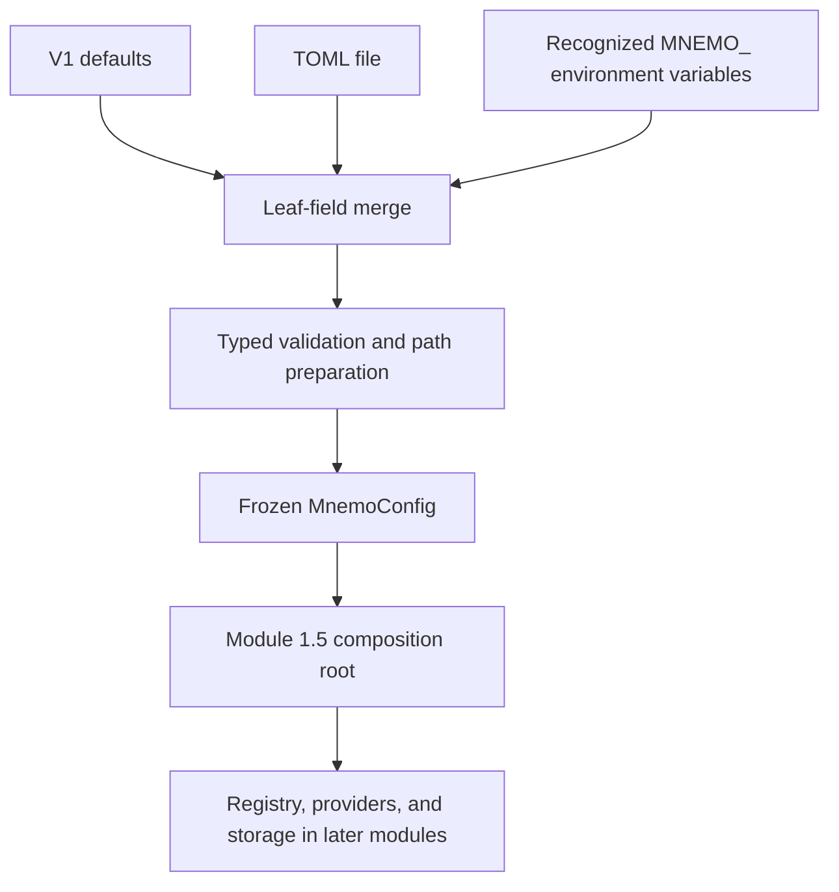

# ADR-0003: Configuration System

- **Status:** Accepted
- **Date:** 2026-08-07
- **Decision owners:** Mnemo maintainers
- **Scope:** Phase 1, Module 1.4
- **Depends on:** ADR-0001, ADR-0002
- **Related documents:** `mnemo_architecture_v2.md`, `mnemo_engineering_roadmap.md`

## 1. Context

Mnemo needs one validated configuration authority before the composition root
is implemented. Without that boundary, storage, model providers, and plugins
would independently read process environment variables or configuration files,
creating inconsistent precedence and validation behavior.

Module 1.4 therefore owns configuration-file parsing, environment overrides,
validation, path resolution, directory preparation, and creation of the frozen
runtime configuration snapshot. Later modules consume that snapshot and do not
read configuration sources directly.

Module 1.3 retains direct support for the legacy `MNEMO_PLUGINS` variable only
for standalone Module 1.x registry compatibility. Module 1.5 is the composition
point and always passes the resolved `plugins.directory` explicitly, so the
engine never asks the registry to read environment configuration.

## 2. Decision goals

The V1 configuration system must:

- expose a small, strongly typed public schema required by the current roadmap;
- apply the fixed precedence defaults, then TOML, then environment variables;
- reject malformed or unknown TOML configuration;
- fail startup with clear validation errors;
- normalize and prepare configured local paths;
- return an immutable snapshot safe to share between components;
- serialize through Pydantic's standard model dump APIs; and
- remain independent of HTTP, databases, Docker, MCP, UI, and runtime business
  logic.

## 3. Non-goals

Module 1.4 does not:

- initialize storage or connect to any configured service;
- instantiate or select plugins or providers;
- modify the Module 1.3 registry;
- implement hot reload;
- read YAML, JSON, dotenv, or another configuration-file format;
- implement secret management or redact configuration values;
- add backend tuning, retries, timeouts, pools, or optimizer settings; or
- define configuration for later roadmap modules.

## 4. Public V1 schema

The complete root schema contains exactly five required sections:

1. `storage`;
2. `llm`;
3. `embedding`;
4. `reranker`; and
5. `plugins`.

Every model is frozen after validation and rejects unknown fields. Provider and
model identifiers are trimmed, non-empty, free-form strings. Provider names
are not checked against an allowlist; later registry composition validates
whether a configured provider is available.

### 4.1 Storage configuration

`StorageConfig` is an aggregate with four required nested backend records.
There is no backend selector: composite storage consists of every backend whose
`enabled` field is true.

| Model | Field | Type | Required | Default | Rules |
|---|---|---:|---:|---:|---|
| `FilesystemStorageConfig` | `enabled` | boolean | no | `true` | Strict boolean after source parsing. |
| | `root` | path | no | `./data/files` | Normalized absolute directory; created if missing; must be writable. |
| `SQLiteStorageConfig` | `enabled` | boolean | no | `true` | Strict boolean after source parsing. |
| | `path` | path | no | `./data/mnemo.db` | Normalized absolute file path; parent created if missing and must be writable. Existing directories are invalid. |
| `QdrantStorageConfig` | `enabled` | boolean | no | `true` | Strict boolean after source parsing. |
| | `url` | HTTP(S) URL | no | `http://localhost:6333` | Scheme is mandatory. |
| | `api_key` | string or null | no | null | Non-empty when present. |
| `SurrealDBStorageConfig` | `enabled` | boolean | no | `true` | Strict boolean after source parsing. |
| | `url` | HTTP(S) URL | no | `http://localhost:8000` | Scheme is mandatory. |
| | `username` | string | no | `root` | Non-empty. |
| | `password` | string | no | `root` | Non-empty. |
| | `namespace` | string | no | `mnemo` | Non-empty. |
| | `database` | string | no | `knowledge` | Non-empty. |

V1 defines no other storage fields. In particular, it exposes no connection
pool, retry, timeout, optimizer, collection, index-tuning, or memmap settings.

### 4.2 Language-model configuration

`LLMConfig` contains exactly four mandatory role fields: `planner`,
`synthesizer`, `extractor`, and `classifier`. Each is an `LLMRoleConfig`.

| `LLMRoleConfig` field | Type | Required | Default | Rules |
|---|---:|---:|---:|---|
| `provider` | string | yes | none | Trimmed and non-empty. |
| `model` | string | yes | none | Trimmed and non-empty. |
| `max_context_tokens` | positive integer | no | role-specific | Booleans are not integers. |

Role defaults for `max_context_tokens` are:

| Role | Default |
|---|---:|
| planner | 8192 |
| synthesizer | 16384 |
| extractor | 8192 |
| classifier | 4096 |

The role defaults belong to `LLMConfig`; a standalone `LLMRoleConfig` has no
universal context default. Provider and model never receive implicit defaults.
Embedder and reranker configuration are not LLM roles.

### 4.3 Embedding configuration

`EmbeddingConfig` has exactly three required fields:

| Field | Type | Rules |
|---|---:|---|
| `provider` | string | Trimmed and non-empty. |
| `model` | string | Trimmed and non-empty. |
| `dimensions` | positive integer | Booleans are not integers. |

It has no batching, caching, or quantization settings.

### 4.4 Reranker configuration

`RerankerConfig` has exactly two required, trimmed, non-empty string fields:
`provider` and `model`. V1 defines no other reranker setting.

### 4.5 Plugin configuration

`PluginConfig` contains one field:

| Field | Type | Required | Default | Rules |
|---|---:|---:|---:|---|
| `directory` | path | no | `./plugins` | Normalized absolute directory; created if missing; must be writable. |

`MNEMO_PLUGINS_DIRECTORY` is the canonical environment variable. The legacy
`MNEMO_PLUGINS` variable is accepted for backward compatibility and is
deprecated. If both are present, the canonical variable wins. Removal of the
legacy alias requires a future compatibility decision.

## 5. Reserved namespaces

The following root names are reserved for additive configuration introduced in
their designated roadmap phases and are not implemented in V1:

- `logging`;
- `cache`;
- `retrieval`;
- `server`;
- `telemetry`;
- `jobs`;
- `scheduler`;
- `ui`;
- `security`;
- `notebooks`;
- `conversation`; and
- `graph`.

Their presence in a V1 TOML file is an unknown key and therefore a validation
error. Reserving a name does not expose a model, default, placeholder, or
runtime behavior.

## 6. Sources, loading, and precedence

### 6.1 TOML

`MnemoConfig.from_file(path)` accepts only a `.toml` file. The canonical name
is `mnemo.toml`, although callers may supply another filename with the same
extension. The path must identify a readable regular file. Missing files,
wrong extensions, invalid TOML, non-table roots, unknown keys, and invalid
values fail loading; none are silently ignored.

The standard-library TOML parser supplies typed values. TOML values are
validated strictly enough that string booleans and string integers do not
silently become their scalar equivalents.

### 6.2 Environment

`MnemoConfig.from_env()` loads defaults and recognized `MNEMO_` environment
variables. Environment values override TOML values in `from_file()`.
Recognized variables follow the flattened field path with uppercase segments:

```text
MNEMO_STORAGE_FILESYSTEM_ENABLED
MNEMO_STORAGE_FILESYSTEM_ROOT
MNEMO_STORAGE_SQLITE_ENABLED
MNEMO_STORAGE_SQLITE_PATH
MNEMO_STORAGE_QDRANT_ENABLED
MNEMO_STORAGE_QDRANT_URL
MNEMO_STORAGE_QDRANT_API_KEY
MNEMO_STORAGE_SURREALDB_ENABLED
MNEMO_STORAGE_SURREALDB_URL
MNEMO_STORAGE_SURREALDB_USERNAME
MNEMO_STORAGE_SURREALDB_PASSWORD
MNEMO_STORAGE_SURREALDB_NAMESPACE
MNEMO_STORAGE_SURREALDB_DATABASE
MNEMO_LLM_PLANNER_PROVIDER
MNEMO_LLM_PLANNER_MODEL
MNEMO_LLM_PLANNER_MAX_CONTEXT_TOKENS
MNEMO_LLM_SYNTHESIZER_PROVIDER
MNEMO_LLM_SYNTHESIZER_MODEL
MNEMO_LLM_SYNTHESIZER_MAX_CONTEXT_TOKENS
MNEMO_LLM_EXTRACTOR_PROVIDER
MNEMO_LLM_EXTRACTOR_MODEL
MNEMO_LLM_EXTRACTOR_MAX_CONTEXT_TOKENS
MNEMO_LLM_CLASSIFIER_PROVIDER
MNEMO_LLM_CLASSIFIER_MODEL
MNEMO_LLM_CLASSIFIER_MAX_CONTEXT_TOKENS
MNEMO_EMBEDDING_PROVIDER
MNEMO_EMBEDDING_MODEL
MNEMO_EMBEDDING_DIMENSIONS
MNEMO_RERANKER_PROVIDER
MNEMO_RERANKER_MODEL
MNEMO_PLUGINS_DIRECTORY
MNEMO_PLUGINS
```

Unknown environment variables, including unknown names under the `MNEMO_`
prefix, are ignored. Recognized malformed values fail validation. Environment
booleans accept only case-insensitive `true` or `false`; integer variables must
contain base-10 integer text. An empty optional `MNEMO_STORAGE_QDRANT_API_KEY`
represents null; other empty recognized values fail their field validation.

### 6.3 Merge semantics

Loading applies this exact order:

```text
model defaults -> TOML values -> environment values -> validation -> frozen snapshot
```

Overrides operate at leaf-field granularity. Supplying one environment field
does not discard sibling TOML fields. There is no deep-merge API exposed to
callers.

## 7. Path semantics and side effects

Relative filesystem, SQLite, and plugin paths loaded by `from_file()` resolve
against the directory containing that configuration file. Paths loaded by
`from_env()` resolve against the current working directory. A relative default
uses the same base as its load operation. User-home markers are expanded before
absolute normalization.

Configuration loading creates the filesystem root, SQLite parent directory,
and plugin directory when absent. It then verifies that directories are
writable using filesystem permission/access checks and rejects conflicting
non-directory paths. It does not create the SQLite database file, write probe
files, initialize storage, or make network connections.

## 8. Immutability and serialization

`MnemoConfig` and every nested configuration model are frozen Pydantic v2
models. Assignment, addition, or deletion after loading fails. Future hot
reload replaces the complete snapshot rather than mutating it.

`model_dump()` provides the standard Python representation, retaining `Path`
and URL value objects. `model_dump(mode="json")` and `model_dump_json()` produce
JSON-compatible strings for paths and URLs. Serialization includes all resolved
values and does not serialize source provenance. Deserialization must pass
through the same validation and unknown-field rejection.

## 9. Errors

Schema violations use Pydantic validation errors with field locations. Loading
failures that occur before schema validation—missing/unreadable files, wrong
file type, malformed TOML, path creation failure, or unwritable paths—raise a
configuration loading error whose message names the affected source or path.
No invalid value falls back to a default.

## 10. Ownership and dependency boundary

The configuration module is the only project authority permitted to read TOML
or process environment variables after Module 1.4. Callers own returned frozen
snapshots and may safely share them across threads and asynchronous tasks.

The module may depend on the Python standard library and Pydantic v2. Pydantic
Settings' automatic source parsing is intentionally not used because V1 has an
explicit flat environment-variable contract and TOML-relative path context.
The module must not depend on server, HTTP, database, Docker, MCP, UI, plugin
implementation, or storage implementation code. Loading performs no network
I/O or provider/backend health checks.

## 11. Compatibility and extension

V1 evolves through additive nested fields or sections introduced only by their
roadmap phases. Existing names and meanings remain stable. Removing or changing
a required field, precedence rule, environment name, default, path base, or
serialization rule is a breaking change and requires ADR review.

Unknown TOML keys remain errors so misspellings cannot silently change startup
behavior. Unknown environment variables remain ignored so unrelated process
environment values and variables intended for later versions do not prevent
startup.

## 12. Dependency graph



## 13. Risks

1. **Environment-name growth.** Flat explicit names are verbose, but they make
   every supported override auditable and avoid ambiguous nested parsing.
2. **Filesystem side effects.** Directory creation during loading is deliberate
   and bounded. It must never create databases or contact services.
3. **Plain-text credentials.** V1 models backend credentials as configuration
   strings because secret management is outside this module. Diagnostics must
   account for that in the later server/security phases.
4. **Legacy registry entrypoint.** Standalone registry callers may still use
   the deprecated `MNEMO_PLUGINS` path during Module 1.x. KnowledgeEngine uses
   only the resolved configuration snapshot.
5. **Strict TOML evolution.** Reserved future sections fail under V1. Operators
   must upgrade Mnemo before using configuration from a later schema.

## 14. Decision

Adopt the exact five-section schema, defaults, source precedence, validation,
path behavior, immutability, serialization, and compatibility rules in this ADR
as the authoritative Module 1.4 specification. Implement no other
configuration tree or runtime integration during Module 1.4.
