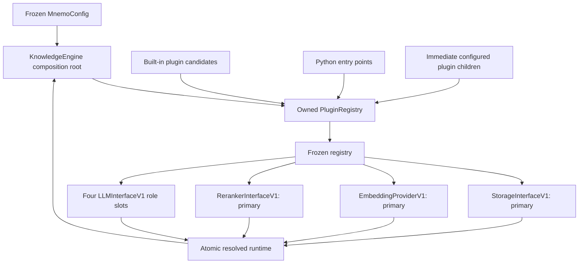

# ADR-0004: KnowledgeEngine Composition

- **Status:** Accepted
- **Date:** 2026-08-07
- **Decision owners:** Mnemo maintainers
- **Scope:** Phase 1, Module 1.5
- **Depends on:** ADR-0001, ADR-0002, ADR-0003
- **Related documents:** `mnemo_architecture_v2.md`, `mnemo_engineering_roadmap.md`

## 1. Context

Phase 1 requires one transport-independent composition root that turns a frozen
`MnemoConfig` into a validated core runtime. The composition root must connect
the configuration authority from Module 1.4 to the plugin registry and public
provider contracts from Modules 1.2 and 1.3 without taking ownership of parsing,
retrieval, storage, model invocation, or other business behavior.

`KnowledgeEngine` is that boundary. It owns runtime construction, dependency
resolution, structural startup validation, lifecycle state, and graceful state
shutdown. It is not an orchestrator and does not contact infrastructure during
Phase 1.

## 2. Decision goals

Module 1.5 must:

- accept only a validated `MnemoConfig` at construction;
- own exactly one active `PluginRegistry` at a time;
- discover plugins in a deterministic order;
- freeze registration before resolving required providers;
- publish a small typed API composed from existing contracts;
- initialize atomically and replace the registry when rollback is required;
- expose immutable provider capability records supplied by providers;
- validate lifecycle transitions explicitly; and
- perform no external I/O.

## 3. Non-goals

Module 1.5 does not:

- expose document ingestion, parsing, chunking, retrieval, reranking, notebook,
  graph, or conversation operations;
- implement or instantiate concrete storage, LLM, embedding, reranking, parser,
  chunker, or retriever providers;
- connect to filesystems, SQLite, Qdrant, SurrealDB, LLMs, embedders, or
  rerankers;
- call provider `open()`, `close()`, or `health_check()` methods;
- implement HTTP, FastAPI, MCP, CLI, Docker, UI, or database behavior;
- invent engine-specific status, health, capability, or provider model classes;
  or
- begin Phase 2 storage work.

## 4. Public API

`KnowledgeEngine` is exported from the top-level `mnemo` package. Its public
surface is limited to the following members.

| Member | Type | Semantics |
|---|---|---|
| constructor | `KnowledgeEngine(config: MnemoConfig)` | Creates an uninitialized engine and its owned open registry. Rejects values that are not `MnemoConfig`. Performs no discovery or external I/O. |
| `initialize()` | asynchronous method returning `None` | Discovers plugins, freezes the registry, resolves and validates required providers, then atomically publishes a ready runtime. |
| `startup()` | asynchronous method returning `None` | Deprecated convenience alias that delegates directly to `initialize()`. Canonical documentation uses `initialize()`. |
| `shutdown()` | asynchronous method returning `None` | Applies the lifecycle rules in section 7. It performs no provider or infrastructure I/O in Phase 1. |
| `config` | read-only `MnemoConfig` property | Returns the exact frozen configuration supplied at construction. |
| `registry` | read-only `PluginRegistry` property | Returns the engine's current actual registry. The engine may replace this object during failed-initialization rollback. Callers cannot register providers through the engine lifecycle. |
| `state` | read-only `EngineState` property | Returns the current lifecycle state. |
| `version` | read-only string property | Returns `mnemo.__version__`. |
| `storage` | read-only `StorageInterfaceV1` property | Returns the resolved `primary` storage façade while ready. |
| `embedding_provider` | read-only `EmbeddingProviderV1` property | Returns the resolved `primary` embedding provider while ready. |
| `reranker` | read-only `RerankerInterfaceV1` property | Returns the resolved `primary` reranker while ready. |
| `llm(role)` | `LLMInterfaceV1` | Accepts only the literal role names `planner`, `synthesizer`, `extractor`, or `classifier` and returns that resolved LLM while ready. |
| `capabilities()` | immutable mapping | Returns capabilities obtained directly from every resolved provider's existing `capabilities()` method. |

The resolved-provider properties and methods return existing protocol
interfaces, not implementation-specific types. Access before `READY`, after
`STOPPED`, or after `FAILED` raises a typed engine lifecycle exception. The
capability mapping uses the fixed keys `storage`, `embedding`, `reranker`,
`planner`, `synthesizer`, `extractor`, and `classifier`; its values are the
existing immutable capability records. There is no Phase 1 health record:
engine health is represented only by `state`.

`EngineState` is the only new public value type required to make the approved
lifecycle states explicit. No additional public model records or provider-role
types are introduced.

## 5. Ownership and construction

The caller owns the immutable configuration snapshot. The engine retains that
snapshot without mutation and owns the registry and resolved-provider
references for its runtime instance.

Construction follows this boundary:

```text
MnemoConfig
    -> KnowledgeEngine
    -> new open PluginRegistry(core_version=mnemo.__version__)
    -> UNINITIALIZED
```

Construction does not discover, register, resolve, freeze, or contact anything.
The registry property is read-only, but it exposes the real registry so callers
can inspect state and immutable descriptors. Registration after construction is
not a supported caller workflow. Once initialization freezes the registry, its
own lifecycle contract prevents mutation.

## 6. Initialization and dependency resolution

`initialize()` executes these steps in order:

1. validate the current lifecycle transition;
2. enter `INITIALIZING`;
3. discover built-in plugin candidates;
4. discover the `mnemo.plugins` Python entry-point group;
5. enumerate and discover configured local plugin candidates;
6. freeze the registry;
7. resolve the required slots;
8. perform structural capability validation;
9. publish the complete resolved-provider snapshot atomically; and
10. enter `READY`.

Built-in candidates use the existing registry plugin contract. Phase 1 ships no
concrete built-in providers, so this candidate collection is empty until later
roadmap modules supply implementations. That empty source is still processed
before entry points and configured paths to preserve the frozen discovery
order.

### 6.1 Configured plugin directory

`config.plugins.directory` is a container of plugin candidates. Discovery:

- inspects immediate children only;
- does not recurse;
- ignores names beginning with `.`;
- includes Python module files ending in `.py`; and
- includes directories only when they contain `__init__.py`.

Candidates are sorted by their path string before being passed explicitly to
the registry path-discovery contract. An absent directory is not expected
because configuration loading prepares it; if it becomes unavailable or is no
longer a directory before initialization, discovery fails.

### 6.2 Required slots

Phase 1 resolves exactly:

| Capability | Slot |
|---|---|
| `StorageInterfaceV1` | `primary` |
| `EmbeddingProviderV1` | `primary` |
| `RerankerInterfaceV1` | `primary` |
| `LLMInterfaceV1` | `planner` |
| `LLMInterfaceV1` | `synthesizer` |
| `LLMInterfaceV1` | `extractor` |
| `LLMInterfaceV1` | `classifier` |

Parser, chunker, and retriever registrations are optional and are not resolved
or validated by Module 1.5.

### 6.3 Structural validation

Validation is intentionally shallow:

- every required slot must resolve;
- storage must structurally satisfy `StorageInterfaceV1`;
- embedding must structurally satisfy `EmbeddingProviderV1`, and both its
  `dimensions` property and advertised capability dimensions must equal
  `config.embedding.dimensions`;
- reranker must structurally satisfy `RerankerInterfaceV1` and return its
  existing immutable capability record;
- every LLM must structurally satisfy `LLMInterfaceV1`, expose non-empty
  `provider` and `model` identifiers, and return its existing immutable
  capability record; and
- capability return values must be instances of their existing typed immutable
  capability classes.

No role-specific flags or implementation-specific semantics are required.
Provider methods that perform work or health checks are not called.

## 7. Lifecycle

`EngineState` has exactly six values:

```text
UNINITIALIZED -> INITIALIZING -> READY -> STOPPING -> STOPPED
                         \
                          -> FAILED
```

`FAILED` is terminal for the runtime instance.

### 7.1 Initialization transitions

- `UNINITIALIZED`: transition through `INITIALIZING` to `READY`.
- `READY`: succeed as an idempotent no-op.
- `STOPPED`: create a fresh open registry, then transition through
  `INITIALIZING` to `READY`.
- `INITIALIZING` or `STOPPING`: reject with a typed lifecycle exception.
- `FAILED`: reject with a typed lifecycle exception.

### 7.2 Shutdown transitions

- `READY`: transition through `STOPPING` to `STOPPED` and clear the published
  provider snapshot.
- `UNINITIALIZED`: succeed as a no-op and remain `UNINITIALIZED`.
- `STOPPED`: succeed as an idempotent no-op.
- `FAILED`: perform best-effort in-memory cleanup, remain `FAILED`, and do not
  raise a cleanup error.
- `INITIALIZING` or `STOPPING`: reject with a typed lifecycle exception.

Phase 1 shutdown never invokes provider lifecycle methods.

### 7.3 Atomicity and concurrency

Initialization and shutdown are serialized per engine instance by an
asynchronous lifecycle lock. A second concurrent call observes the state after
the first operation completes and then applies the idempotence rules above.
Resolved providers are built in local state and published only after all
validation succeeds. Readers can therefore observe either no published runtime
or the complete immutable provider snapshot, never a partial composition.

## 8. Failure and rollback

Public engine errors extend the shared interface exception taxonomy:

- `KnowledgeEngineError` is the base composition failure;
- `EngineLifecycleError` represents illegal lifecycle use; and
- `EngineInitializationError` represents discovery, resolution, compatibility,
  or structural validation failure.

They retain the shared stable `code`, `message`, `retryable`, and immutable
`details` behavior. Raw registry, plugin, validation, or provider exceptions do
not cross the engine boundary.

On initialization failure, the engine:

1. clears any unpublished or previously stopped provider references;
2. discards the attempted registry;
3. constructs a fresh open owned registry for inspection and best-effort
   cleanup consistency;
4. enters `FAILED`; and
5. raises `EngineInitializationError` chained from the internal cause.

Plugin discovery results are isolated by Module 1.3. A failed candidate that
advertises `storage`, `embedding_provider`, `reranker`, or `llm` is fatal. A
failed candidate with only optional advertised capabilities remains represented
in discovery results and does not prevent readiness. Independently, missing or
invalid required slots always fail final composition. This classification uses
the immutable plugin descriptor rather than filenames.

## 9. Immutability and thread safety

The engine's configuration reference is immutable. The published provider set
is stored as one immutable internal snapshot and is replaced as a whole during
lifecycle changes. The public capability mapping is immutable. Registry
metadata and provider capability records retain the immutability guarantees of
Modules 1.2 and 1.3.

The asynchronous lifecycle lock makes initialization and shutdown atomic among
tasks using the same event loop. Synchronous property reads never perform I/O.
Thread-safe invocation of provider implementations remains the responsibility
of those later implementations under ADR-0002.

## 10. Dependency boundaries

KnowledgeEngine may depend only on:

- `MnemoConfig`;
- `PluginRegistry` and its immutable metadata/results;
- public Module 1.2 provider protocols, capability records, and exception
  taxonomy;
- `mnemo.__version__`; and
- Python standard-library lifecycle and path primitives.

It must not depend on transport, server, database, concrete storage, plugin
implementation, Docker, MCP, CLI, or UI packages.

## 11. Compatibility

The canonical lifecycle method is `initialize()`. `startup()` is deprecated
from introduction and may be removed only through a future compatibility
decision. Documentation and new integrations use `initialize()`.

The fixed provider slots, lifecycle meanings, property names, discovery order,
and no-I/O Phase 1 boundary are public compatibility guarantees. Future phases
may add business operations or activate provider resource lifecycle only through
their designated roadmap work; they must not change the Phase 1 composition
semantics silently.

## 12. Dependency graph



## 13. Risks

1. **No concrete providers in Phase 1.** A real engine cannot become ready until
   plugins from later modules or third-party packages supply every required
   slot. This is intentional dependency validation, not a placeholder runtime.
2. **Registry identity after rollback.** Because rollback replaces the owned
   registry, a previously obtained registry reference becomes historical. The
   `registry` property always returns the current owned instance.
3. **Deprecated alias longevity.** `startup()` exists only for ergonomics. New
   callers using it increase future removal cost, so documentation must use
   `initialize()` consistently.
4. **Structural validation boundary.** Phase 1 proves interface shape and
   declared metadata, not connectivity or provider correctness. Operational
   validation remains explicitly deferred.
5. **Local plugin trust.** Importing configured Python plugins executes their
   module initialization code. Sandboxing and security policy belong to later
   roadmap phases.

## 14. Decision

Adopt `KnowledgeEngine` as the thin, asynchronous, transport-independent Phase
1 composition root with the exact public surface, discovery sequence, required
slots, structural checks, lifecycle transitions, rollback behavior, and no-I/O
boundary defined above. Implement no Phase 2 behavior.
