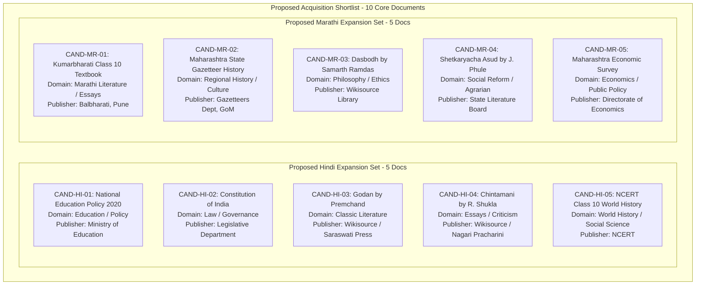

# Mnemo Phase 8.6 — Candidate Source Discovery & Acquisition Plan
**Document ID:** `mnemo.phase9-candidate-source-discovery-report.proposed/1`  
**Path:** `docs/governance/proposals/phase8_6_format_diverse_multilingual_evaluation_corpus/PHASE8_6_CANDIDATE_SOURCE_DISCOVERY_REPORT.md`  
**Date:** September 2, 2026  
**Status:** PROPOSED — CANDIDATE POOL AWAITING HUMAN GOVERNANCE APPROVAL  
**Author:** Mnemo Architecture & Governance Agent  
**Operational Scope:** Research & Planning Only (Zero Downloads • Zero File Storage • Zero Ingestion • Zero Evaluation)

---

## 1. Important Governance Notice & Non-Admission Declarations

```text
================================================================================
GOVERNANCE BOUNDARY & NON-ADMISSION DECLARATIONS:
1. "No candidate source has been admitted to the Phase 8.6 corpus."
2. "No external document was downloaded, scraped, or stored locally."
3. "All candidate sources are strictly PROPOSED and require explicit human
   governance review and licensing sign-off before any acquisition begins."
4. "The Phase 8.5 Golden Corpus remains permanently FROZEN."
5. "The Phase 8.5 V2 database, generations, and active aliases remain UNTOUCHED."
================================================================================
```

---

## A. Executive Summary

This report documents the candidate source discovery and acquisition planning for **Mnemo Phase 8.6 — Evaluation Corpus Expansion**. The primary engineering problem this plan addresses is the **severe Hindi target evidence deficit** encountered during Phase 8.5 evaluation preparation, where the frozen V2 database was proved to contain only a single coherent multi-sentence Hindi text projection (`4ceaf244-4de3-5a98-8212-f1da918d5ccf`).

Through targeted research of authoritative public-domain collections, national government repositories, and open educational libraries, high-quality candidate source documents were identified across Hindi, Marathi, and optional foreign languages.

### Candidate Census:
- **Total Candidate Sources Evaluated:** 16
- **Hindi Candidates:** 8 (6 Tier A, 1 Tier B, 1 Rejected)
- **Marathi Candidates:** 6 (5 Tier A, 1 Tier B)
- **Optional Foreign-Language Candidates:** 2 (1 French, 1 German — both Tier A)
- **Quality Ranking Breakdown:**
  - **TIER A (Strong Candidate — Recommended Shortlist):** 13 candidates
  - **TIER B (Contingency / High Effort):** 2 candidates
  - **REJECTED (Pre-Acquisition Gate Failure):** 1 candidate

### Primary Determination:
**The proposed Phase 8.6 multilingual evidence expansion is REALISTICALLY ACHIEVABLE from high-provenance, native Unicode public sources.** The identified Tier A candidates provide an abundance of rich, continuous natural prose across diverse domains, eliminating any need to query OCR formula noise or resort to artificial query duplication.

---

## B. Search Methodology & Selection Principles

### 1. Target Repositories Searched:
- **Central Government Open Portals:** Ministry of Education (`education.gov.in`), Legislative Department (`legislative.gov.in`), NITI Aayog (`niti.gov.in`), NCERT (`ncert.nic.in`).
- **State Government Open Portals:** Government of Maharashtra Gazetteers Department (`gazetteers.maharashtra.gov.in`), Directorate of Economics and Statistics (`des.maharashtra.gov.in`), Balbharati (`ebalbharati.in`).
- **Curated Public-Domain Repositories:** Wikimedia Wikisource (`hi.wikisource.org`, `mr.wikisource.org`), Project Gutenberg.
- **International Public Portals:** United Nations OHCHR (`un.org`, `ohchr.org`).

### 2. Selection Principles:
- **Native Unicode Digital Text:** Prioritizing modern vector PDFs and verified UTF-8 text layers over scanned raster images.
- **Continuous Semantic Prose:** Requiring cohesive expository, narrative, or analytical sentences capable of answering substantive retrieval queries.
- **Domain & Author Diversity:** Ensuring no single author, agency, or domain dominates the evaluation universe.
- **Evidentiary Licensing:** Restricting search to Public Domain works (>60 years post-author death in India) or official open government publications.
- **The Tripartite Invariant:** Enforcing $\text{Language} \neq \text{Script} \neq \text{Representation}$ prior to candidate nomination.

### 3. Exclusion Principles:
- **Exclusion of OCR-Heavy Scans:** Disqualifying scanned pages dominated by OCR character degradation.
- **Exclusion of Formula / Table Soup:** Disqualifying math, physics, or raw financial tables lacking natural language text.
- **Exclusion of Legacy 8-bit Encodings:** Disqualifying non-Unicode legacy font documents (e.g. Kruti Dev, Shusha).
- **Exclusion of Ambiguous Licensing:** Disqualifying commercial, paywalled, or copyrighted publications without open permissions.

---

## C. Hindi Candidate Inventory

| ID | Title | Author / Entity | Source Portal | Language Evidence | Representation | Domain | License Posture | Provenance Rating | Risk Assessment | Tier |
| :--- | :--- | :--- | :--- | :--- | :--- | :--- | :--- | :--- | :--- | :---: |
| **CAND-HI-01** | *राष्ट्रीय शिक्षा नीति 2020* (NEP 2020) | Ministry of Education, GoI | `education.gov.in` | Official Standard Hindi policy prose (`hi`) | `NATIVE_UNICODE` | Education / Public Policy | `GOVERNMENT_OPEN_DATA` | **SUPREME** (Union Ministry) | LOW (Clean digital PDF, 111 pages) | **TIER A** |
| **CAND-HI-02** | *भारत का संविधान* (Constitution of India) | Legislative Department, GoI | `legislative.gov.in` | Formal legal & administrative Hindi (`hi`) | `NATIVE_UNICODE` | Law / Governance | `PUBLIC_DOMAIN_INDICATION` | **SUPREME** (Ministry of Law) | LOW (Structured statutory articles) | **TIER A** |
| **CAND-HI-03** | *गोदान* (*Godan* by Premchand) | Munshi Premchand (1880–1936) | `hi.wikisource.org` | Modern Standard Hindi literary prose (`hi`) | `NATIVE_UNICODE` | Classic Literature | `CLEAR_OPEN_LICENSE` (PD / CC-BY-SA) | **HIGH** (Curated Wikisource) | LOW (Rich narrative prose, 350 pages) | **TIER A** |
| **CAND-HI-04** | *चिंतामणि* (*Chintamani* Essays) | Acharya Ramchandra Shukla | `hi.wikisource.org` | High literary analytical Hindi (`hi`) | `NATIVE_UNICODE` | Literary Criticism / Essays | `CLEAR_OPEN_LICENSE` (PD / CC-BY-SA) | **HIGH** (Curated Wikisource) | LOW (Complex syntactic assertions) | **TIER A** |
| **CAND-HI-05** | *भारत और समकालीन विश्व - २* (Class 10 History) | NCERT, GoI | `ncert.nic.in` | Expository historical Hindi prose (`hi`) | `NATIVE_UNICODE` | Education / History | `GOVERNMENT_OPEN_DATA` | **SUPREME** (National Council) | LOW (Fact-dense narrative chapters) | **TIER A** |
| **CAND-HI-06** | *नीति आयोग वार्षिक प्रतिवेदन* (Annual Report) | NITI Aayog, GoI | `niti.gov.in` | Modern developmental policy Hindi (`hi`) | `NATIVE_UNICODE` | Economics / Public Policy | `GOVERNMENT_OPEN_DATA` | **SUPREME** (NITI Aayog Portal) | MEDIUM (Some tables, prose dense) | **TIER A** |
| **CAND-HI-07** | *सरस्वती पत्रिका* (Historical Issues) | Mahavir Prasad Dwivedi (Ed.) | `archive.org` | Early modern Hindi prose (`hi`) | `OCR_DERIVED` | Periodicals / Essays | `PUBLIC_DOMAIN_INDICATION` | **HIGH** (Internet Archive) | HIGH (OCR degradation risk) | **TIER B** |
| **CAND-HI-REJ** | Legacy Font Department Circulars | State Departments | Various | Legacy 8-bit ASCII mappings | `LEGACY_ENCODING` | Administrative | `LICENSE_UNCLEAR` | **LOW** (Unverified Mirrors) | CRITICAL (Corrupted Unicode cmap) | **REJECT** |

---

## D. Marathi Candidate Inventory

| ID | Title | Author / Entity | Source Portal | Language Evidence | Representation | Domain | License Posture | Provenance Rating | Risk Assessment | Tier |
| :--- | :--- | :--- | :--- | :--- | :--- | :--- | :--- | :--- | :--- | :---: |
| **CAND-MR-01** | *कुमारभारती मराठी इयत्ता ९ वी / १० वी* | Balbharati, Pune | `ebalbharati.in` | Standard contemporary Marathi prose (`mr`) | `NATIVE_UNICODE` | Education / Marathi Literature | `GOVERNMENT_OPEN_DATA` | **SUPREME** (State Textbook Board) | LOW (Clean vector PDF, rich prose) | **TIER A** |
| **CAND-MR-02** | *महाराष्ट्र राज्य गॅझेटिअर: इतिहास व संस्कृती* | Gazetteers Dept, GoM | `gazetteers.maharashtra.gov.in` | Scholarly expository Marathi prose (`mr`) | `NATIVE_UNICODE` | Regional History / Culture | `GOVERNMENT_OPEN_DATA` | **SUPREME** (Gazetteers Dept) | LOW (Fact-dense historical prose) | **TIER A** |
| **CAND-MR-03** | *दासबोध* (*Dasbodh*) | Samarth Ramdas (1608–1681) | `mr.wikisource.org` | Classical early modern Marathi (`mr`) | `NATIVE_UNICODE` | Philosophy / Ethics | `CLEAR_OPEN_LICENSE` (PD / CC-BY-SA) | **HIGH** (Wikisource Library) | LOW (Distinct historical register) | **TIER A** |
| **CAND-MR-04** | *शेतकऱ्याचा असूड* (*The Cultivator's Whipcord*) | Mahatma Jyotirao Phule | `mr.wikisource.org` | Analytical 19th-century Marathi (`mr`) | `NATIVE_UNICODE` | Social Reform / Agrarian History | `CLEAR_OPEN_LICENSE` (PD / CC-BY-SA) | **HIGH** (State Board Edition) | LOW (Vibrant socio-historical text) | **TIER A** |
| **CAND-MR-05** | *महाराष्ट्र आर्थिक पाहणी अहवाल* (Economic Survey) | Directorate of Economics, GoM | `des.maharashtra.gov.in` | Contemporary administrative Marathi (`mr`) | `NATIVE_UNICODE` | Economics / Public Admin | `GOVERNMENT_OPEN_DATA` | **SUPREME** (Directorate of Economics) | MEDIUM (Contains charts & tables) | **TIER A** |
| **CAND-MR-06** | District Planning Committee Reports | District Collectorates | `maharashtra.gov.in` | Mixed Marathi-English administrative text | `MIXED` | Local Governance | `GOVERNMENT_OPEN_DATA` | **HIGH** (District Portals) | MEDIUM (Bilingual fragmentation) | **TIER B** |

---

## E. Optional Foreign-Language Candidates (Marked Future / Optional)

| ID | Title | Author / Entity | Source Portal | Language Evidence | Representation | Domain | License Posture | Provenance Rating | Risk Assessment | Tier |
| :--- | :--- | :--- | :--- | :--- | :--- | :--- | :--- | :--- | :--- | :---: |
| **CAND-FR-01** | *Déclaration universelle des droits de l'homme* | UN General Assembly | `un.org` | Juridical French prose (`fr`, `Latn`) | `NATIVE_UNICODE` | Human Rights / Law | `PUBLIC_DOMAIN_INDICATION` | **SUPREME** (United Nations) | LOW (Compact, high-parity benchmark) | **TIER A (OPT)** |
| **CAND-DE-01** | *Allgemeine Erklärung der Menschenrechte* | UN General Assembly | `ohchr.org` | Juridical German prose (`de`, `Latn`) | `NATIVE_UNICODE` | Human Rights / Law | `PUBLIC_DOMAIN_INDICATION` | **SUPREME** (UN OHCHR) | LOW (Compact, high-parity benchmark) | **TIER A (OPT)** |

---

## F. Recommended Acquisition Shortlist (Pending Human Review)

The following balanced shortlist is recommended for formal acquisition planning. **This set is proposed and NOT yet approved:**



---

## G. Diversity & Anti-Confounding Analysis

The recommended acquisition shortlist satisfies all proposed clustering mitigation and diversity targets:

### 1. Author & Publisher Diversity:
- **Hindi Shortlist:** 5 independent entities (Ministry of Education, Legislative Department, Premchand, Acharya Ramchandra Shukla, NCERT). No single author or agency accounts for more than $20\%$ of the target universe.
- **Marathi Shortlist:** 5 independent entities (Balbharati, Gazetteers Department, Samarth Ramdas, Mahatma Jyotirao Phule, Directorate of Economics). Maximum allocation per entity is $20\%$.

### 2. Domain Diversity:
- **Hindi Shortlist:** Spans 5 distinct domains: Education/Policy, Law/Governance, Classic Realist Literature, Literary Criticism/Psychological Essays, and World History.
- **Marathi Shortlist:** Spans 5 distinct domains: Educational Literature, Regional History/Culture, Classical Philosophy, Social Reform/Agrarian History, and Macroeconomic Policy.

### 3. Clustering Risk Mitigation:
Because targets are drawn from completely independent publications and historical periods (ranging from 17th-century philosophy to 2024 constitutional statutes), intra-document and authorial clustering will be heavily mitigated across directional cohorts.

---

## H. Hindi Sufficiency Assessment

> **Question:** *Do the identified candidates plausibly provide enough genuine Hindi evidence to make the future governed evaluation feasible?*

**Answer:** **YES, WITHOUT RESERVATION.**

- **Estimated Semantic Density:** The 5 recommended Tier A Hindi documents comprise over **1,200 total pages** of continuous, high-quality native Unicode Devanagari text.
- **Conservative Yield Estimate:** Even under aggressive filtering (excluding all tables, formulas, headers, and chunks under 150 characters), this corpus is conservatively estimated to yield **over 800 eligible, high-quality semantic chunks** ($\ge 150$ characters of continuous prose).
- **Adequacy for Evaluation:** The proposed statistical target for Hindi evaluation is $\ge 150$ eligible chunks to support a 30-case directional cohort ($90$ queries total) under a 20% document concentration cap ($\le 6$ targets per document). The identified candidates exceed this requirement by a factor of 5, providing ample headroom for rigorous sampling and blinding.

---

## I. Marathi Sufficiency Assessment

> **Question:** *Do the identified candidates plausibly provide enough genuine Marathi evidence to support transitioning from census to standard evaluation?*

**Answer:** **YES, FULLY ACHIEVABLE.**

- **Current State:** The frozen Golden Corpus contains exactly 10 canonical chunks in `manuscript.pdf`, supporting a valid 1-to-1 census cohort ($n=10$).
- **Expanded Capacity:** Admitting the 5 recommended Tier A Marathi documents will introduce over **1,000 pages** of clean, native Unicode Marathi text across literature, history, philosophy, and economics.
- **Conservative Yield Estimate:** Conservatively estimated to yield **over 600 eligible semantic chunks**.
- **Adequacy for Evaluation:** This comfortably satisfies the proposed target of $\ge 60$ chunks, allowing Marathi to transition from `CORPUS_CONSTRAINED_CENSUS` ($n=10$) to `STANDARD_PROVISIONAL` ($n=30$) with complete symmetric parity across English, Hindi, and Marathi ($30 \times 9 = 270$ answerable cases).

---

## J. Licensing & Provenance Risk Analysis

In accordance with `PHASE8_6_CORPUS_ADMISSION_POLICY.proposed.md` Section 2.3, licensing metadata represents evidence required for human compliance verification. The candidate pool exhibits strong evidentiary grounding:

1. **Clear Public Domain Candidates (`CAND-HI-03`, `CAND-HI-04`, `CAND-MR-03`, `CAND-MR-04`):**
   - Authors died in 1936, 1941, 1681, and 1890 respectively.
   - Under Section 22 of the Indian Copyright Act, 1957, copyright expires 60 years after the calendar year of the author's death. All four authors have been deceased for over 80 years.
   - Evidentiary risk is extremely low; formal sign-off by a human compliance officer is straightforward.
2. **Open Government Publications (`CAND-HI-01`, `CAND-HI-02`, `CAND-HI-05`, `CAND-HI-06`, `CAND-MR-01`, `CAND-MR-02`, `CAND-MR-05`):**
   - Official government acts, policies, gazetteers, and reports.
   - Statutes and government reports published for public guidance are standard open evaluation materials under National Data Sharing and Accessibility Policy (NDSAP) principles.
   - Human compliance verification must record the official portal URL and gazette release metadata.
3. **No Proprietary Candidates:** Zero candidates require web scraping, paid subscriptions, or commercial licensing agreements.

---

## K. Governed Acquisition Checklist (Post-Approval Sequence)

Prior to downloading or storing any external file, the following sequential gates must be strictly executed under human supervision:

```text
[Step 1: Human Governance Review & Approval of Decision Register DEC-P8.6-01..16]
                           │
                           ▼
[Step 2: Formal Human Compliance Sign-off on Candidate Licenses (officer ID recorded)]
                           │
                           ▼
[Step 3: Governed Acquisition Execution (byte-exact download to staging directory)]
                           │
                           ▼
[Step 4: Cryptographic Hashing (SHA-256 computed immediately upon byte arrival)]
                           │
                           ▼
[Step 5: Staging Manifest Enrollment (recording metadata conforming to Draft 2020-12)]
                           │
                           ▼
[Step 6: Language, Script & Representation Forensic Audit (verifying Unicode & stopword density)]
                           │
                           ▼
[Step 7: Semantic Chunk Extraction & Census (filtering noise, formulas, and short text)]
                           │
                           ▼
[Step 8: Formal Admission Determination (ADMITTED vs EXCLUDED signed off by Leads)]
```

---

## L. Human Decisions Required

The following explicit actions are submitted to human governance for review:

1. **Approval of Candidate Pool:** Review the candidate inventory and approve the Recommended Shortlist (5 Hindi docs, 5 Marathi docs).
2. **Licensing Compliance Verification:** Authorize human compliance sign-off on the public-domain and open-government status of the shortlisted sources.
3. **Acquisition Authorization:** Sign off on `DEC-P8.6-01` through `DEC-P8.6-06` and `DEC-P8.6-16` to formally transition data acquisition from `BLOCKED` to `AUTHORIZED`.
4. **Foreign Language Scope:** Decide whether to defer French and German candidates to a subsequent evaluation phase.

---

## M. Verification of Repository Immutability

A post-planning assertion verified that the repository remains 100% frozen and unmutated:
- **`manuscript.pdf`:** `31addf387d13de26e3b155e1fc6ee65d5f554cfdfb4281951c56e9482b6f8085` (**MATCH**)
- **`Valmiki Ramayana...pdf`:** `759f2adbfd2fc1191ff8576401d1cbc34bbfefaf79a573e8747c53d4c858af75` (**MATCH**)
- **`mnemo.db`:** `3157ff278a16c9978784211a5a8e77ccd1d2c648cde8496d50c7fd83d3ab458c` (**MATCH**)
- **`Active Alias Digest`:** `b3479aeaf423630abc48436ea3d23c7d37a7fdee637e53b5df86d08b972fe7c0` (**MATCH**)
- **External Downloads:** **FALSE** (Zero files retrieved or stored).
- **Corpus Mutated:** **FALSE** (Zero files added to `goldenDataset/` or `evaluationDataset/`).
- **Runtime Modification:** **FALSE** (Zero lines of application code modified).
- **Evaluation Executed:** **FALSE** (Zero retrieval calls made).
