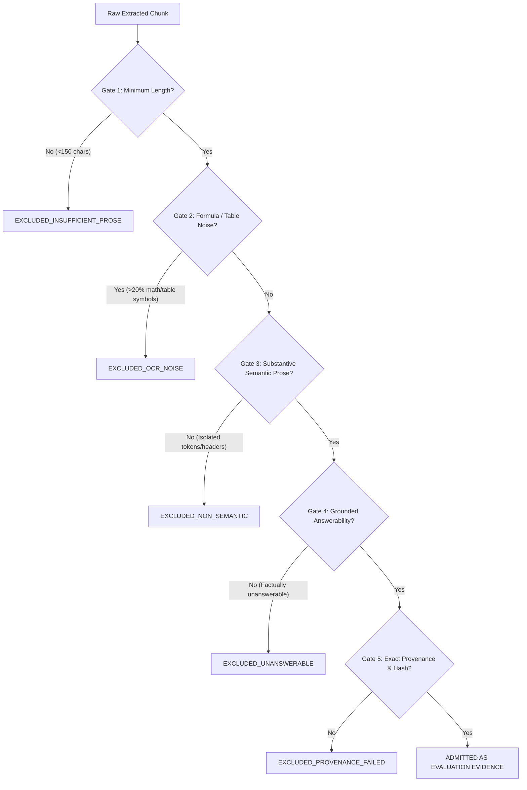

# Mnemo Phase 8.6 — Multilingual Evaluation Corpus Admission Policy
**Document ID:** `mnemo.phase9-corpus-admission-policy.proposed/1`  
**Path:** `docs/governance/proposals/phase8_6_format_diverse_multilingual_evaluation_corpus/PHASE8_6_CORPUS_ADMISSION_POLICY.proposed.md`  
**Status:** PROPOSED — AWAITING HUMAN GOVERNANCE APPROVAL  
**Governance Scope:** Evaluation Corpus Expansion Only (No Production / No Runtime Mutation)

---

## 1. Purpose & Architectural Mandate

This policy establishes strict evidence-quality admission gates, acquisition governance, licensing verification, and linguistic validation protocols for the **Phase 8.6 Format-Diverse Multilingual Evaluation Corpus**.

The primary purpose of the expansion corpus is to provide genuine, multi-document semantic evidence to resolve the multilingual evaluation blocker identified in Phase 8.5 (specifically, the forensic reality that the frozen Phase 8.5 V2 database contains only **one single coherent multi-sentence Hindi text projection**).

This policy enforces the foundational architectural invariant:
$$\text{Language} \neq \text{Script} \neq \text{Representation}$$

No document or chunk may be admitted into the evaluation corpus based on filename, folder structure, or script observation alone. Every evaluation target MUST prove genuine semantic viability under the gates codified below.

---

## 2. Document Acquisition & Source Governance

### 2.1 Pre-Acquisition Prohibition
Engineering agents are strictly prohibited from downloading, scraping, or copying external documents until:
1. This policy is ratified by human governance.
2. The specific document acquisition list is approved by human governance.
3. Every proposed document has an identified legal license and evaluation permission.

### 2.2 Mandatory and Optional Document Metadata
Every document proposed for admission into the Phase 8.6 Evaluation Corpus MUST be accompanied by metadata recorded in the corpus manifest (`PHASE8_6_EVALUATION_CORPUS_SCHEMA.proposed.json`):

| Metadata Field | Type | Requirement | Verification Standard |
| :--- | :--- | :---: | :--- |
| `document_id` | UUID | Mandatory | Cryptographically stable UUIDv5 generated from canonical source URI. |
| `version_id` | UUID | Mandatory | Unique version UUID for the ingested file state. |
| `relative_path` | String | Mandatory | Relative path within `evaluationDataset/Phase 8.6 Format-Diverse Multilingual Evaluation Corpus/`. |
| `file_byte_size` | Integer | Mandatory | Exact byte size on disk ($\ge 1$). |
| `file_sha256` | Hex String | Mandatory | 64-character lowercase SHA-256 digest computed over raw bytes. |
| `mime_type` | String | Mandatory | Standard MIME type (`application/pdf`, `text/plain`, etc.). |
| `page_count` | Integer | Optional | Total page count for paginated document formats (e.g. PDF, $\ge 1$). |
| `transformation_lineage` | Array | Optional | Audit record of representation transformations applied to this document. |
| `source_url` | URI | Mandatory | Verifiable origin URI (archive.org, government portal, academic repository). |
| `publisher_or_author` | String | Mandatory | Authoritative publishing entity or author name. |
| `retrieved_at` | ISO-8601 | Mandatory | Timestamp of retrieval in UTC. |
| `retrieved_by_actor_id` | String | Mandatory | Identifier of the human operator or automated ingestion task. |
| `acquisition_method` | String | Mandatory | One of: `manual_curated_download`, `authorized_open_repository_api`, `direct_author_submission`, `public_domain_archive_retrieval`. |
| `original_filename` | String | Mandatory | Filename as provided by the origin publisher. |

### 2.3 Licensing & Evaluation Use Gate

> [!IMPORTANT]
> **Legal Compliance & Evidentiary Verification Notice:**
> All licensing, copyright, and provenance metadata recorded under this policy represents **evidence required for human compliance verification**. Recording license metadata does NOT constitute an automated legal determination, a formal legal opinion, or an assertion by any engineering agent or automated system that a document is legally usable.
> The engineering rule is: **verifiable evidence of licensing and evaluation permission must be reviewed and signed off by an authorized human compliance officer before corpus admission.** Engineering agents and automated ingestion scripts are strictly prohibited from making autonomous legal determinations.

The evaluation corpus must not incur copyright infringement or licensing ambiguity. Prior to admission:
1. **Permitted Evaluation Licenses:** Candidate documents MUST possess verifiable evidence of release under one of:
   - Public Domain
   - Creative Commons Zero (CC0 1.0)
   - Creative Commons Attribution (CC-BY 4.0 or CC-BY-SA 4.0)
   - Open Government Data License
   - Explicit Written Authorization from Author for Academic/Evaluation Use
2. **Mandatory Human Sign-off:** The corpus manifest must record:
   - `license_type`: Exact license identifier.
   - `copyright_holder`: Authoritative entity.
   - `evaluation_use_verified`: Boolean `true` (certified by human officer).
   - `verification_officer_id`: Human governance reviewer ID.
   - `verification_timestamp`: UTC timestamp of sign-off.
3. **Strict Gate:** Any document lacking verified evaluation rights is **AUTOMATICALLY EXCLUDED** (`EXCLUDED_UNRESOLVED_LICENSE`).

---

## 3. Linguistic & Script Validation Governance

### 3.1 The Tripartite Distinction
The repository architectural model strictly enforces:
- **Language:** The semantic communicative system (e.g., Hindi `hi`, Marathi `mr`, English `en`, Sanskrit `sa`).
- **Script:** The writing system / glyph inventory (e.g., Devanagari `Deva`, Latin `Latn`).
- **Representation:** The computational encoding and source derivation (e.g., `unicode_semantic_text`, `ocr_region`, `legacy_krutidev`).

### 3.2 Prohibited Inferences
The admission pipeline strictly forbids the following invalid inferences:
1. **Script $\to$ Language:** Observing Devanagari glyphs (Unicode block `U+0900`–`U+097F`) DOES NOT imply Hindi. Devanagari is shared by Hindi, Marathi, Sanskrit, Konkani, Nepali, and mathematical equation OCR noise.
2. **Filename $\to$ Language:** A filename containing Hindi words (e.g., `PHYSICS_JEE_ADVANCED.pdf` or `Valmiki Ramayana...`) DOES NOT imply that its indexed content is valid Hindi prose.
3. **OCR Region $\to$ Semantic Text:** Raw text extracted by OCR from charts, formulas, or borders DOES NOT constitute semantic evaluation evidence.

### 3.3 Target Language Validation Pipelines

#### A. Hindi (`hi`) Validation Requirements
To qualify as an admitted Hindi document:
1. **Encoding:** Must be native UTF-8 Unicode Devanagari. Legacy font encodings (e.g. Kruti Dev, Shusha, DV-TTSurekh) are excluded unless passed through a certified, verified loss-free transcoding pipeline.
2. **Textuality:** Must be native digital prose or high-confidence OCR ($\ge 98\%$ character accuracy on prose).
3. **Lexical & Grammatical Gate:** Must contain continuous Hindi prose featuring characteristic grammatical morphemes (e.g. `है`, `हैं`, `था`, `थी`, `थे`, `रहा है`, `किया गया`, `के लिए`, `द्वारा`) with a validated Hindi stopword density $\ge 8\%$.
4. **Differentiation from Sanskrit:** Religious or liturgical texts consisting primarily of Sanskrit verses (shlokas) with noun case endings (`-स्य`, `-म्`, `-तः`) are classified as Sanskrit (`sa`), NOT Hindi.
5. **Differentiation from Marathi:** Texts containing Marathi grammatical markers (`आहे`, `होते`, `केले`, `त्यांच्या`, `मध्ये`) are classified as Marathi (`mr`), NOT Hindi.
6. **Differentiation from OCR Noise:** Mathematical formulas containing isolated Devanagari letters (e.g. `व. न र डक ं कर गज...`) are **IMMEDIATELY REJECTED** as OCR noise.

#### B. Marathi (`mr`) Validation Requirements
To qualify as an admitted Marathi document:
1. **Encoding:** Native UTF-8 Unicode Devanagari.
2. **Lexical Gate:** Continuous Marathi prose featuring authentic Marathi morphology (e.g. `आहे`, `नाही`, `होते`, `म्हणाले`, `केले`, `झाले`, `त्यांच्या`, `साठी`).
3. **Differentiation:** Explicit rejection of Hindi/Sanskrit Devanagari text mislabeled as Marathi.

#### C. Generic Foreign-Language Admission Pipeline
For any future foreign language candidate:
$$\text{Raw Source} \xrightarrow{\text{Gate 1: Encoding UTF-8}} \text{Decoded Text} \xrightarrow{\text{Gate 2: Script Census}} \text{Script Profile} \xrightarrow{\text{Gate 3: Morpho-Syntactic Detector}} \text{Language Claim} \xrightarrow{\text{Gate 4: Linguistic Sanity Audit}} \text{Admitted}$$

---

## 4. Evidence Quality Gates

Every candidate chunk extracted from an admitted document must pass through five rigorous quality gates before becoming eligible as evaluation evidence:

### 4.1 Explicit Disqualifiers
The following items are **CATEGORICALLY DISQUALIFIED** from serving as evaluation evidence:
- **OCR Garbage:** Scrambled characters, broken lines, formula axes.
- **Mathematical Formulations:** Chunks dominated by math equations, variables, or coordinate values.
- **Table Fragments:** Isolated numbers or headers lacking natural language assertions.
- **Decorative Captions:** Isolated picture labels, photographer credits, or page numbers.
- **Title / Metadata Substitution:** Queries asking about document titles or filenames rather than passage text.
- **Synthetic / LLM-Generated Text:** Machine-generated passages designed to inflate corpus size (unless governed explicitly under a synthetic benchmark track).

---

## 5. Clustering Mitigation & Anti-Confounding Rules

> [!NOTE]
> **Statistical Independence & Clustering Qualification:**
> Document capping, chunk separation, and domain diversification serve as **clustering mitigation and anti-confounding controls**, NOT mathematical guarantees of pure identically and independently distributed (i.i.d.) statistical independence. In real-world multi-document corpora:
> - Multiple chunks extracted from the same document or author inevitably exhibit intra-cluster correlation (shared vocabulary, domain semantics, and authorial style).
> - Multiple evaluation queries across cross-lingual directions (e.g., `en->mr-001`, `hi->mr-001`, `mr->mr-001`) intentionally share the exact same underlying target evidence unit by design to evaluate cross-lingual retrieval parity.
> - Document allocation caps reduce concentration but do not eliminate correlation.
> All formal statistical independence assumptions remain subject to explicit human governance and statistical review.

To mitigate cluster confounding and prevent single-document domination:

1. **Document Concentration Cap:** As a proposed concentration limit, no single document may provide more than $20\%$ of the target evidence chunks in any directional cohort ($\le 6$ targets per document for an $n=30$ target cohort).
2. **Domain Diversity Rule:** Each language cohort MUST draw targets from at least three distinct domains (e.g. literature, technical/academic, administrative/governmental, biographical/journalistic).
3. **Author Diversity Rule:** No single author or organization may account for more than $30\%$ of the target evidence universe for a language.
4. **Non-Overlapping Target Rule:** Every answerable case in a directional cohort must target a distinct chunk or distinct factual proposition. Repeatedly asking different questions about the same paragraph solely to inflate $n$ is strictly forbidden.
5. **Separation of Negative Controls:** Negative control queries must remain 100% ungrounded across the entire corpus and must never share semantic targets with answerable cases.

---

## 6. Admission Audit & Lifecycle Governance

### 6.1 Admission Lifecycle States
Every document proposed for expansion transitions through explicit states:
- `PENDING_REVIEW`: Ingested into staging, undergoing metadata audit.
- `ADMITTED`: Passed all quality, linguistic, licensing, and independence gates.
- `EXCLUDED_OCR_NOISE`: Disqualified due to OCR artifacts or math formulas.
- `EXCLUDED_INSUFFICIENT_PROSE`: Disqualified due to lack of continuous text.
- `EXCLUDED_UNRESOLVED_LICENSE`: Disqualified due to copyright/use ambiguity.
- `EXCLUDED_WRONG_LANGUAGE`: Disqualified due to failed linguistic validation.

### 6.2 Admission Sign-off
Admission into the final Phase 8.6 Evaluation Corpus manifest requires a dual cryptographic sign-off by:
1. The **Corpus Engineering Lead** (validating byte-level integrity, format, and hashes).
2. The **Linguistic & Governance Lead** (validating language identity, licensing, and independence).
