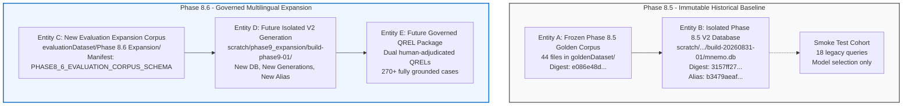

# Mnemo Phase 8.6 — Evaluation Corpus Expansion Governance Proposal
**Document ID:** `mnemo.phase9-evaluation-corpus-expansion-proposal.proposed/1`  
**Path:** `docs/governance/proposals/phase8_6_format_diverse_multilingual_evaluation_corpus/PHASE8_6_EVALUATION_CORPUS_EXPANSION_GOVERNANCE_PROPOSAL.md`  
**Date:** September 2, 2026  
**Status:** PROPOSED — AWAITING HUMAN GOVERNANCE APPROVAL  
**Author:** Mnemo Architecture & Governance Agent  
**Operational Scope:** Proposal Only (No Downloads • No Ingestion • No Runtime Mutation • No Evaluation Execution)

---

## 1. Executive Determination

A forensic audit of the Mnemo repository has established that the frozen Phase 8.5 V2 database contains **exactly one (1)** coherent multi-sentence Hindi text projection (`4ceaf244-4de3-5a98-8212-f1da918d5ccf`, Ambassador Bhagwant Singh Bishnoi's foreword in `Valmiki Ramayana`). All other 139 Devanagari projection rows are OCR noise from math equations, table lines, or decorative captions.

Consequently, the proposed 240-case governed evaluation pack (`V2_GOVERNED_CASE_INVENTORY.proposed.json`) has reached a physical evidence hard stop: authoring 30 independent Hindi cases per direction ($90$ queries total) is impossible without either querying broken math OCR character soup or repeating the same foreword fact 29 times.

This proposal formally recommends establishing **Mnemo Phase 8.6 — Evaluation Corpus Expansion**, a separately governed phase whose purpose is to acquire genuine, multi-document multilingual evidence under strict licensing, linguistic validation, and evidence quality gates.

```text
===============================================================================
DETERMINATION: EXPANSION GOVERNANCE PROPOSAL READY FOR HUMAN REVIEW
===============================================================================
Phase 8.5 Golden Corpus: STRICTLY FROZEN (SHA-256 asserts unchanged)
Phase 8.5 V2 Database: STRICTLY FROZEN (SHA-256 asserts unchanged)
Active V2 Alias Set: STRICTLY FROZEN (Digest asserts unchanged)
Evaluation Execution: FALSE (Zero queries run, zero lifecycle advancement)
Proposed Expansion Phase: PHASE 8.6 (Isolated namespace, isolated DB, isolated build)
Human Governance Action: REQUIRED (Review and sign off Decision Register DEC-P8.6-01..16)
===============================================================================
```

---

## 2. Core Architectural Distinction (The Five Pillars)

To guarantee absolute benchmark integrity and historical reproducibility, this proposal establishes a strict separation between five distinct architectural entities. Merging, aliasing, or cross-contaminating these entities is strictly prohibited:



### Definition of the Five Entities:
1. **Entity A: Frozen Phase 8.5 Golden Corpus:**  
   The historical 44-document evaluation corpus located at `goldenDataset/Phase 8.5 Evaluation Corpus/`. Preserved permanently under SHA-256 digest `e086e48dda72b9bc38f6cb4d4f68a60bc5af7dfa38b47b49659fc3312a2efd9b`. Must never be modified, appended to, or deleted.
2. **Entity B: Existing Isolated Phase 8.5 V2 Evaluation Database:**  
   The frozen SQLite database at `scratch/phase8_5_full_multilingual_v2/build-20260831-01/mnemo.db` (SHA-256: `3157ff27...`) bound to active alias digest `b3479aeaf...`. Hosts generation `gen-20260831-01`. Serves as the reproducible baseline for model-selection smoke testing.
3. **Entity C: New Evaluation Expansion Corpus:**  
   A separate corpus namespace located at `evaluationDataset/Phase 8.6 Format-Diverse Multilingual Evaluation Corpus/`. Contains only external documents admitted under `PHASE8_6_CORPUS_ADMISSION_POLICY.proposed.md`. Managed by a dedicated manifest conforming to `PHASE8_6_EVALUATION_CORPUS_SCHEMA.proposed.json`.
4. **Entity D: Future Isolated V2 Generation Built from Expansion Corpus:**  
   A future isolated build run (`build-phase9-01`) producing an independent SQLite database (`scratch/phase9_expansion/mnemo.db`), with new generation UUIDs, an independent vector-space identity, and a new alias set.
5. **Entity E: Future Governed Evaluation / QREL Package:**  
   The comprehensive evaluation package containing 270+ answerable cases ($30 \times 9$ directions) and 30 negative controls, with dual human-adjudicated QREL judgments, frozen under an immutable QREL digest prior to evaluation.

---

## 3. The Golden Corpus Boundary

### 3.1 Separation Justification
In benchmark engineering, retrospective corpus modification creates severe methodological flaws:
- **Historical Invalidation:** Modifying the Golden Corpus makes it impossible to reproduce earlier test runs, smoke tests, or preflight determinations.
- **Population Drift:** Injecting documents changes the underlying distribution of token frequencies, term statistics (BM25), and embedding neighborhood densities, destroying comparability.
- **Evaluation Leakage:** Adding documents specifically chosen after observing model failures introduces severe confirmation bias.

### 3.2 Immutability Guarantees
1. **Distinct Namespace:** All expansion files are strictly sequestered in `evaluationDataset/` rather than `goldenDataset/`.
2. **Cryptographic Assertion:** Automated CI pre-flight scripts will compute the SHA-256 hashes of `manuscript.pdf` and `Valmiki Ramayana aur Ramakien...pdf` before every build. Any hash delta immediately aborts the pipeline.
3. **Manifest Lineage:** Future evaluation reports must explicitly cite the `corpus_manifest_digest`. A report citing Phase 8.5 must match digest `e086e48d...`; a report citing Phase 8.6 must match the newly generated expansion digest.

---

## 4. Source Acquisition & Licensing Governance

### 4.1 Acquisition Standards
External documents must be acquired following the four-stage protocol codified in `PHASE8_6_CORPUS_ADMISSION_POLICY.proposed.md`:
1. **Candidate Proposal:** A candidate document must be proposed with complete provenance (source URL, publisher, author, retrieval timestamp, original filename).
2. **Licensing Sign-Off:** A human governance officer must verify that the document is released under an open evaluation license (Public Domain, CC0, CC-BY 4.0, or Open Government Data License).
3. **Acquisition Execution:** Upon sign-off, the file is retrieved via byte-exact download, hashed (SHA-256), and placed in staging.
4. **Manifest Enrollment:** The document record is added to the Phase 8.6 corpus manifest.

### 4.2 Prohibited Acquisition Practices
- Automated web scraping or crawling without pre-approved URL whitelists.
- Ingestion of proprietary, copyrighted, or paywalled articles.
- Ingestion of documents with ambiguous or unspecified licensing.
- Machine generation of text passages using LLMs to artificially inflate corpus size.

---

## 5. Linguistic, Script, and Representation Governance

### 5.1 Enforcing $\text{Language} \neq \text{Script} \neq \text{Representation}$
Phase 8.5 proved that treating Devanagari script observations as equivalent to Hindi prose resulted in 120 OCR artifact rows being misclassified as candidate Hindi evidence. Phase 8.6 enforces strict multi-dimensional validation:

```text
[Input Byte Stream]
        │
        ▼ (Gate 1: Byte-level UTF-8 validation)
[Decoded Unicode String]
        │
        ▼ (Gate 2: Script census via Unicode blocks)
[Script Observation: ISO-15924 (e.g. Deva)]
        │
        ▼ (Gate 3: Morpho-syntactic stopword & morpheme density)
[Language Classification: BCP-47 (e.g. hi vs mr vs sa)]
        │
        ▼ (Gate 4: Prose continuity & noise filter)
[Semantic Text Projection: unicode_semantic_text]
```

### 5.2 Specific Language Admission Requirements

> [!IMPORTANT]
> **Governance Notice on Numerical Sizing Targets:**
> All numerical values specified in this section and throughout this proposal (including $\ge 5$ Hindi documents, $\ge 150$ Hindi chunks, 3–5 Marathi documents, $\ge 60$ Marathi chunks, $n=30$ per direction, max 20% document allocation, 270 answerable cases, and 30 negative controls) are **PROPOSED STATISTICAL AND GOVERNANCE SIZING TARGETS**. They are NOT immutable architectural requirements, NOT existing V2 requirements, and NOT automatically binding implementation constraints. They represent engineering recommendations that strictly require explicit human governance approval before adoption.

#### A. Hindi (`hi`) Expansion Requirements
- **Format:** Native digital UTF-8 Devanagari text (clean digital PDFs or UTF-8 text files). Scanned PDFs requiring OCR are excluded to avoid repeating the math table noise failure.
- **Lexical Filter:** Stopword density $\ge 8\%$ featuring Hindi markers (`है`, `हैं`, `था`, `थी`, `रहा है`, `किया गया`, `के लिए`).
- **Differentiation:** Rejection of Sanskrit shlokas and Marathi grammatical constructions.
- **Proposed Sizing Target:** Target acquisition of 5 to 10 distinct documents across 3+ domains (literature, history, administrative reports, science), yielding $\ge 150$ eligible semantic chunks (subject to human approval).

#### B. Marathi (`mr`) Expansion Requirements
- **Current State:** 10 canonical chunks in `manuscript.pdf` currently support a valid 30-case census ($10 \times 3$ directions).
- **Expansion Recommendation (Option D):** Target acquisition of 3 to 5 diverse Marathi documents to obtain $\ge 60$ eligible chunks. This allows transitioning Marathi from `CORPUS_CONSTRAINED_CENSUS` ($n=10$) to `STANDARD_PROVISIONAL` ($n=30$), achieving complete symmetry across English, Hindi, and Marathi ($30 \times 9 = 270$ answerable cases, subject to human approval).

#### C. Foreign Language Onboarding Pipeline
Any future foreign language (e.g., French, German, Tamil, Japanese) must follow the standardized 9-stage onboarding pipeline:
1. Formal Language Charter & Rationale.
2. Acquisition Governance & Licensing Sign-off.
3. Native Encoding & Script Verification.
4. Linguistic & Morpho-Syntactic Gate.
5. Semantic Evidence Census ($\ge 100$ candidate chunks).
6. Corpus Sufficiency Review.
7. Dual-Reviewer QREL Authoring & Adjudication.
8. Isolated V2 Build Run.
9. Governed Benchmark Evaluation.

---

## 6. Evidence Quality Gates & Independence Rules

### 6.1 Admission Quality Gates
To qualify as an evaluation target chunk, the text MUST:
1. Contain continuous natural language prose ($\ge 150$ characters).
2. Have zero mathematical formula character soup or broken table lines.
3. Contain verified semantic assertions capable of answering an independent query.
4. Have stable UUIDs (`document_id`, `version_id`, `evidence_id`) and an exact `source_content_hash`.

### 6.2 Clustering Mitigation & Anti-Confounding Rules

> [!NOTE]
> **Statistical Independence & Clustering Qualification:**
> Document capping, chunk separation, and domain diversification serve as **clustering mitigation and anti-confounding controls**, NOT mathematical guarantees of pure identically and independently distributed (i.i.d.) statistical independence. In real-world multi-document corpora:
> - Chunks from the same document, author, or topic inevitably exhibit intra-cluster correlation (shared vocabulary, domain semantics, and authorial style).
> - Multiple evaluation queries across cross-lingual directions (e.g., `en->mr-001`, `hi->mr-001`, `mr->mr-001`) intentionally share the exact same underlying target evidence unit by design to evaluate cross-lingual retrieval parity.
> - Document allocation caps reduce concentration but do not eliminate correlation.
> All formal statistical independence assumptions remain subject to explicit human governance and statistical review.

1. **Document Concentration Cap:** As a proposed concentration limit, no single document should provide more than $20\%$ of the target evidence chunks in any directional cohort ($\le 6$ targets per document for an $n=30$ target cohort).
2. **Domain Diversity Rule:** Each language cohort MUST draw targets from at least three distinct domains (e.g. literature, technical/academic, administrative/governmental, biographical/journalistic).
3. **No Duplicate Query Overlap:** Every query in a directional cohort must test an independent factual proposition. Multiple queries targeting the exact same paragraph solely to inflate sample size are strictly forbidden.
4. **Negative Controls:** 30 natural unsupported queries (10 en, 10 hi, 10 mr) must be evaluated exclusively on false support rates and excluded from ranking metrics.

---

## 7. QREL Governance & Human Adjudication

In strict accordance with `mnemo.models.multilingual_evaluation.EvidenceQrelV2` and `multilingual_qrels.schema.json`:
1. **Opaque Evidence References:** QRELs must reference exact UUIDs and SHA-256 source content hashes.
2. **Dual Independent Reviewers:** Every candidate case must be independently graded by two native or fluent speakers of the query and target languages.
3. **Mandatory Adjudication:** Any disagreement between Reviewer 1 and Reviewer 2 must be adjudicated by a certified third adjudicator.
4. **Zero Automated Labels:** Automated LLM-generated relevance labels are strictly prohibited.
5. **QREL Digest Freeze:** Upon completion of adjudication, all QRELs must be compiled into `multilingual_qrels.v2.json`, cryptographically hashed, and frozen before any retrieval execution occurs.

---

## 8. Evaluation Independence & Comparability

### 8.1 Preventing Contamination
- **Administrative Escrow of Test Cases:** Phase 8.6 evaluation queries will be held in administrative escrow as an operational governance procedure (e.g. retaining evaluation manifest files in a secured administrative directory inaccessible to index builders and automated pipelines). This is an operational/administrative protocol for protecting evaluation queries from indexing, runtime tuning, and benchmark optimization, NOT an automated software subsystem in the runtime codebase.
- **Prohibition on Evaluation Tuning:** Runtime adapters, fusion weights, and prompt configurations must NOT be adjusted against Phase 8.6 evaluation results.
- **Model Selection Separation:** The 18-case controlled evaluation remains designated strictly as an adapter smoke test and cannot be used as certification evidence.

### 8.2 Benchmark Comparability
Changing the corpus fundamentally changes the retrieval population. Therefore:
- Phase 8.6 evaluation metrics (Recall@k, MRR, nDCG@10) CANNOT be directly compared against Phase 8.5 smoke test numbers.
- All future evaluation reports MUST publish complete provenance digests:
  - `corpus_manifest_digest`
  - `database_id`
  - `build_run_id`
  - `generation_ids`
  - `active_alias_set_digest`
  - `vector_space_identity`
  - `qrel_digest`
  - `threshold_contract_digest`

---

## 9. Generation, Storage, and Lifecycle Architecture

### 9.1 Storage Isolation
The Phase 8.6 build will execute in complete isolation from the current Phase 8.5 database:
- **Build Run ID:** New UUIDv4 (e.g. `build-phase9-01`).
- **Database Path:** `scratch/phase9_expansion/build-phase9-01/mnemo.db`.
- **Generation IDs:** Independent capability generation IDs for `language_text_v2`, `dense_embeddings_v2`, `sparse_lexical_v2`.
- **Alias Set:** New active alias set digest specific to Phase 8.6.
- **Current Active State:** The current Phase 8.5 active alias set (`b3479aeaf4...`) in `scratch/phase8_5_full_multilingual_v2/` will remain 100% active and untouched during Phase 8.6 preparation.

### 9.2 Decoupled Lifecycle Trajectory
```text
Phase 8.5 Status: [DECLARED: PASS] -> [IMPLEMENTED: PASS] -> [CONFIGURED: PASS] -> [BUILDABLE: PASS] -> [READY: PASS] -> [ACTIVE: PASS] -> (EVALUATED: FALSE / FROZEN)

Phase 8.6 Status:   [DECLARED: PROPOSED] -> (Awaiting Human Governance Approval)
```
Phase 8.5 remains frozen at `ACTIVE: PASS` as an operational baseline. Phase 8.6 begins at `DECLARED` and will progress through the standard 10-state lifecycle upon human authorization.

---

## 10. Summary of Human Governance Decisions

The complete decision register (`PHASE8_6_EVALUATION_CORPUS_EXPANSION_DECISION_REGISTER.md`) documents 16 explicit governance decisions:

1. **DEC-P8.6-01:** Authorize establishment of Phase 8.6 Format-Diverse Multilingual Evaluation Corpus.
2. **DEC-P8.6-02:** Approve directory naming `evaluationDataset/Phase 8.6 Format-Diverse Multilingual Evaluation Corpus/`.
3. **DEC-P8.6-03:** Enforce strict physical and cryptographic freeze on Golden Corpus.
4. **DEC-P8.6-04:** Ratify pre-approved external source acquisition protocol.
5. **DEC-P8.6-05:** Establish verified open license requirements with officer sign-off.
6. **DEC-P8.6-06:** Approve Hindi expansion sizing ($\ge 5$ docs, $\ge 150$ chunks, $n=30$).
7. **DEC-P8.6-07:** Approve Marathi expansion strategy (acquire 3–5 docs to achieve $n=30$ symmetry).
8. **DEC-P8.6-08:** Approve reusable 9-stage foreign language admission pipeline.
9. **DEC-P8.6-09:** Enforce 20% document capping and domain diversity independence rules.
10. **DEC-P8.6-10:** Ratify blinded case authoring and non-duplication policy.
11. **DEC-P8.6-11:** Mandate dual human QREL reviewers with certified language competency.
12. **DEC-P8.6-12:** Preserve threshold contract as `NOT YET DEFENSIBLE` until pilot data review.
13. **DEC-P8.6-13:** Enforce strict data leakage and benchmark contamination boundaries.
14. **DEC-P8.6-14:** Mandate isolated build run, database, and generation IDs for Phase 8.6.
15. **DEC-P8.6-15:** Ratify decoupled lifecycle tracking across Phase 8.5 and Phase 8.6.
16. **DEC-P8.6-16:** Confirm data acquisition remains **BLOCKED** until DEC-P8.6-01..06 are approved.

---

## 11. Verification & Safety Assertion

A comprehensive verification check was executed following artifact generation:
- **Golden Corpus Mutation:** **FALSE** (Zero files added, modified, or removed).
- **V2 Database Mutation:** **FALSE** (`mnemo.db` SHA-256: `3157ff27...` identical).
- **Active Alias Mutation:** **FALSE** (Digest: `b3479aeaf4...` identical).
- **Vector Space Mutation:** **FALSE** (Model weights, dimensions, and profiles untouched).
- **Runtime Modification:** **FALSE** (Zero lines of application/retrieval code modified).
- **Evaluation Execution:** **FALSE** (Zero retrieval calls made).
- **Schema Validation:** `PHASE8_6_EVALUATION_CORPUS_SCHEMA.proposed.json` compiled and validated as Draft 2020-12 compliant.
