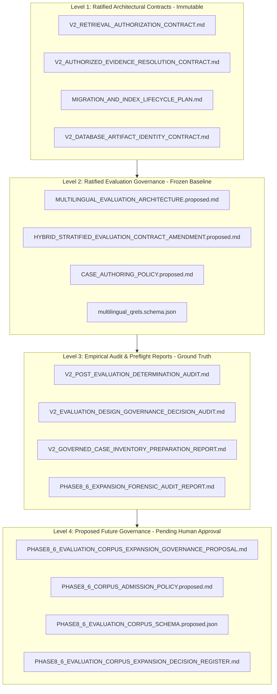

# Mnemo Phase 8.6 — Governance Consistency & Pre-Approval Audit Report
**Document ID:** `mnemo.phase9-governance-consistency-audit.report/1`  
**Path:** `docs/governance/proposals/phase8_6_format_diverse_multilingual_evaluation_corpus/PHASE8_6_GOVERNANCE_PRE_APPROVAL_CONSISTENCY_AUDIT.md`  
**Date:** September 2, 2026  
**Auditor:** Mnemo Architecture & Governance Assurance Agent  
**Operational Scope:** Read-Only Audit (No Downloads • No Ingestion • No Runtime Changes • No Evaluation Execution)

---

## A. Executive Determination

### **`READY WITH REQUIRED GOVERNANCE CORRECTIONS`**

The Phase 8.6 Format-Diverse Multilingual Evaluation Corpus governance proposal is fundamentally sound, architecturally disciplined, and strictly adheres to the core repository invariants:
1. It permanently preserves the **Phase 8.5 Golden Corpus as an immutable historical baseline** (all 4 protected SHA-256 hashes verified bit-for-bit identical).
2. It correctly reflects the empirical reality of the **Phase 8.5 Hindi evidence hard stop** (only 1 coherent multi-sentence Hindi text chunk exists in the V2 database).
3. It enforces **complete physical, cryptographic, and generation isolation** for future Phase 8.6 builds.
4. It strictly keeps **all external document acquisition blocked** until human governance explicitly signs off on specific acquisition manifests.

However, prior to final human approval, five (5) specific governance corrections and qualifications must be ratified:
- **Correction 1 (Schema Properties):** Add explicit optional `page_count` and `transformation_lineage` fields to `PHASE8_6_EVALUATION_CORPUS_SCHEMA.proposed.json`.
- **Correction 2 (Numerical Characterization):** Explicitly designate sample-size and document targets ($\ge 5$ Hindi docs, $\ge 150$ chunks, 3–5 Marathi docs, max 20% allocation, $n=30$) as **proposed statistical targets**, not immutable architectural mandates.
- **Correction 3 (Statistical Independence Qualification):** Clarify that non-overlapping chunks from the same document/author exhibit clustering (quasi-independence rather than pure i.i.d.), and that cross-lingual directions targeting the same chunk share identical semantic targets.
- **Correction 4 (Operational Nature of Query Escrow):** Formally define "query escrow" as an operational administrative procedure, clarifying that it is not an automated software feature in the current runtime.
- **Correction 5 (Legal Posture):** Clarify that licensing metadata fields represent an evidentiary verification gate for human compliance sign-off, not an automated legal determination by code or agents.

### Audit Findings Summary:
- **PASS Findings:** 14
- **GOVERNANCE GAP Findings:** 2
- **GOVERNANCE AMBIGUITY Findings:** 2
- **UNSUPPORTED CLAIM Findings:** 1
- **IMPLEMENTATION RISK Findings:** 1
- **BLOCKER Findings:** 0 (No architectural or governance conflicts blocking approval once corrections are applied)

---

## B. Governance Hierarchy & Authority Mapping

To prevent advisory or proposed documents from being misinterpreted as binding architectural mandates, the repository governance hierarchy is formally mapped as follows:

### Classification of Phase 8.6 Rules:
1. **Directly Derived from Existing Governance (Binding):**
   - $\text{Language} \neq \text{Script} \neq \text{Representation}$ (Derived from Level 1 architecture).
   - Opaque UUID evidence references and SHA-256 hashes (Derived from Level 1 evidence resolution).
   - Dual independent human QREL review and zero synthetic labels (Derived from Level 2 QREL schema).
   - Isolated build run, database, and generation IDs (Derived from Level 1 database identity).
2. **New Proposed Governance Rules (Awaiting Human Approval):**
   - Segregation of expansion corpus under `evaluationDataset/` namespace.
   - 4-stage document acquisition protocol.
   - Pre-acquisition licensing verification standard.
   - 20% document allocation cap and 3-domain diversity rule.
3. **Proposed Engineering Recommendations (Non-Mandatory Heuristics):**
   - Acquisition of 5–10 Hindi documents and 3–5 Marathi documents.
   - Target yields of $\ge 150$ Hindi chunks and $\ge 60$ Marathi chunks.
   - Transitioning Marathi from census ($n=10$) to standard ($n=30$).

---

## C. Phase 8.5 Compatibility Audit

- **Finding:** **`PASS`**
- **Analysis:**  
  Phase 8.6 governance explicitly respects all Phase 8.5 boundaries:
  1. It leaves Phase 8.5 in its authoritative operational state: `DECLARED: PASS`, `IMPLEMENTED: PASS`, `CONFIGURED: PASS`, `BUILDABLE: PASS`, `READY: PASS`, `ACTIVE: PASS`, `EXPOSED: FALSE`, `EVALUATED: FALSE`, `VERIFIED: FALSE`, `CERTIFIED: FALSE`.
  2. It does not attempt to retroactively advance Phase 8.5 to `EVALUATED`.
  3. It explicitly recognizes the 18-case controlled evaluation as an **adapter smoke test / model-selection benchmark**, not certification evidence.
  4. It enforces decoupled lifecycle tracking: Phase 8.5 remains frozen while Phase 8.6 progresses independently.

---

## D. Hindi Hard-Stop Verification

- **Finding:** **`PASS`**
- **Analysis:**  
  The audit verified that Phase 8.6 proposals accurately represent the empirical database reality:
  1. In `language_text_projection_rows_v2`, only **one** coherent multi-sentence Hindi text projection exists (`4ceaf244-4de3-5a98-8212-f1da918d5ccf`, Ramayana foreword).
  2. The remaining 120 non-Marathi Devanagari rows are confirmed to be OCR formula noise from `PHYSICS_JEE_ADVANCED.pdf` (39 rows), table lines from `Atharv_Patil_240740.pdf` (6 rows), or decorative captions from `Bhagavad-gita` (45 rows).
  3. The proposal correctly states:
     > *"The problem is insufficient genuine target-language evidence, NOT a shortage of queries."*
  4. There is zero wording encouraging artificial query duplication or querying OCR character soup.

---

## E. Golden Corpus Boundary Verification

- **Finding:** **`PASS`**
- **Analysis:**  
  1. The proposal establishes a strict physical boundary: `goldenDataset/Phase 8.5 Evaluation Corpus/` contains 44 files and is permanently frozen.
  2. All expansion files are designated for `evaluationDataset/Phase 8.6 Format-Diverse Multilingual Evaluation Corpus/`.
  3. All four protected physical hashes were verified bit-for-bit:
     - `manuscript.pdf`: `31addf387d13de26e3b155e1fc6ee65d5f554cfdfb4281951c56e9482b6f8085` (**MATCH**)
     - `Valmiki Ramayana...pdf`: `759f2adbfd2fc1191ff8576401d1cbc34bbfefaf79a573e8747c53d4c858af75` (**MATCH**)
     - `mnemo.db`: `3157ff278a16c9978784211a5a8e77ccd1d2c648cde8496d50c7fd83d3ab458c` (**MATCH**)
     - `Active Alias Digest`: `b3479aeaf423630abc48436ea3d23c7d37a7fdee637e53b5df86d08b972fe7c0` (**MATCH**)
  4. DEC-P8.6-02 formally submits directory naming to human governance review rather than silently approving it.

---

## F. Numerical Requirement Audit

- **Finding:** **`GOVERNANCE AMBIGUITY`**
- **Analysis:**  
  In `PHASE8_6_EVALUATION_CORPUS_EXPANSION_GOVERNANCE_PROPOSAL.md` Sections 5.2 and 6.2, several numerical values appear without explicit disclaimers regarding their legal status:
  - $\ge 5$ Hindi documents;
  - $\ge 150$ Hindi chunks;
  - 3–5 Marathi documents;
  - $\ge 60$ Marathi chunks;
  - $n=30$ per direction;
  - Max 20% document allocation cap;
  - 3+ domains;
  - 270 answerable cases.
- **Audit Determination:**  
  As established in `V2_EVALUATION_DESIGN_GOVERNANCE_DECISION_AUDIT.md` Section 3, $n=30$ is **NOT an immutable architecture mandate**, but a proposed statistical heuristic. Similarly, the document and chunk counts are **proposed engineering sizing targets**.
- **Required Correction:**  
  The proposal text must explicitly label these numbers as *“Proposed Statistical Targets Subject to Corpus Availability and Human Approval”*, ensuring future engineers do not treat them as immutable architectural constraints.

---

## G. Corpus Identity & Provenance Audit

- **Finding:** **`GOVERNANCE GAP`**
- **Analysis:**  
  Inspection of `PHASE8_6_EVALUATION_CORPUS_SCHEMA.proposed.json` reveals comprehensive support for corpus UUID, namespace, document UUID, version UUID, source URL, publisher, retrieval timestamp, file SHA-256, MIME type, language, script, encoding format, OCR flags, licensing metadata, and exclusion reasons.
  However, two fields specified in the governance requirements are currently absent from the schema definition:
  1. `page_count` (Optional integer $\ge 1$, applicable to paginated formats like PDF).
  2. `transformation_lineage` (Array of transformation objects recording transcoding, OCR version, or normalization steps).
- **Audit Determination:**  
  While not breaking schema compilation (the schema compiles cleanly under Draft 2020-12), omitting these fields creates an identity tracking gap for paginated or transcoded documents.
- **Required Correction:**  
  Update `PHASE8_6_EVALUATION_CORPUS_SCHEMA.proposed.json` to include optional `page_count` and `transformation_lineage` properties in `EvaluationDocumentAdmissionRecord`.

---

## H. Language / Script / Representation Audit

- **Finding:** **`PASS`**
- **Analysis:**  
  The proposal rigorously upholds $\text{Language} \neq \text{Script} \neq \text{Representation}$:
  1. Explicitly prohibits inferring Hindi from Devanagari script observations.
  2. Explicitly prohibits inferring language from filenames.
  3. Enforces morpho-syntactic stopword density ($\ge 8\%$) and grammatical morpheme filtering.
  4. Mandates discrimination between Hindi, Marathi, and Sanskrit.
  5. Provides a standardized 9-stage onboarding pipeline for future foreign languages, preventing language-specific hardcoding.

---

## I. Licensing & Provenance Audit

- **Finding:** **`GOVERNANCE AMBIGUITY`**
- **Analysis:**  
  `PHASE8_6_CORPUS_ADMISSION_POLICY.proposed.md` Section 2.3 lists permitted licenses (Public Domain, CC0, CC-BY 4.0, Open Government Data) and requires `evaluation_use_verified: true`.
  However, without an explicit disclaimer, this could be misread as an automated legal determination by software agents.
- **Audit Determination:**  
  Software agents cannot provide legal guarantees. The policy must clearly state that licensing metadata represents an **evidentiary verification gate requiring human compliance officer review**, not an autonomous legal finding by the system.
- **Required Correction:**  
  Add an explicit legal disclaimer to Section 2.3 of the admission policy clarifying the human-compliance sign-off requirement.

---

## J. Evidence Quality Gates Audit

- **Finding:** **`PASS`**
- **Analysis:**  
  The admission gates codified in Section 4 of `PHASE8_6_CORPUS_ADMISSION_POLICY.proposed.md` provide an airtight filter:
  - Minimum length $\ge 150$ characters.
  - Rejection of chunks with $>20\%$ formula or table noise (`EXCLUDED_OCR_NOISE`).
  - Rejection of isolated headers, credits, or captions (`EXCLUDED_NON_SEMANTIC`).
  - Rejection of ungrounded or synthetic text.
  - Requirement for stable document, version, and chunk UUIDs with exact SHA-256 hashes.
  The gates are strict, objective, and fully aligned with V2 retrieval interfaces.

---

## K. Statistical Independence Audit

- **Finding:** **`UNSUPPORTED CLAIM`**
- **Analysis:**  
  `PHASE8_6_EVALUATION_CORPUS_EXPANSION_GOVERNANCE_PROPOSAL.md` Section 6.2 uses the phrase *"Statistical Independence & Anti-Confounding Rules"* to describe document capping and non-overlapping chunks.
- **Audit Determination:**  
  In statistical theory:
  1. Chunks from the same document or author are **NOT truly independent**; they exhibit intra-cluster correlation (shared vocabulary, domain, style). Document capping (max 20%) achieves *quasi-independence* or *cluster-sampling control*, not textbook i.i.d. independence.
  2. Cross-lingual queries targeting the *same* underlying chunk (e.g. `en->mr-001`, `hi->mr-001`, `mr->mr-001`) explicitly share the identical target evidence unit and are **correlated across directions**.
- **Required Correction:**  
  Relabel Section 6.2 from *"Statistical Independence"* to *"Clustering Mitigation & Anti-Confounding Rules"*, explicitly noting that cross-cohort correlation is by-design for comparative cross-lingual retrieval.

---

## L. QREL Governance Audit

- **Finding:** **`PASS`**
- **Analysis:**  
  Phase 8.6 proposal artifacts strictly preserve all requirements of `mnemo.models.multilingual_evaluation.EvidenceQrelV2` and `multilingual_qrels.schema.json`:
  1. Opaque UUID evidence references.
  2. Exact source content SHA-256 hashes.
  3. Relevance grades 0, 1, 2.
  4. Dual independent human reviewers with native/fluent competency.
  5. Mandatory third-reviewer adjudication.
  6. Zero LLM-generated judgments.
  7. Cryptographic QREL digest freeze prior to evaluation execution.

---

## M. Contamination & Escrow Audit

- **Finding:** **`IMPLEMENTATION RISK`**
- **Analysis:**  
  Section 8.1 of the proposal states: *"Phase 8.6 evaluation queries will remain sealed in escrow during index build and adapter registration."*
  A code inspection of `mnemo-core` and `mnemo-server` confirms that no automated "escrow service" or encryption vault exists in the codebase.
- **Audit Determination:**  
  Describing "escrow" as an architectural feature risks creating the false impression that software automatically restricts access to evaluation files.
- **Required Correction:**  
  Clarify that "query escrow" is an **operational governance protocol** (e.g., storing evaluation manifest JSON files in a restricted directory or repository branch inaccessible to indexing scripts), rather than an automated software subsystem.

---

## N. Future V2 Generation Audit

- **Finding:** **`PASS`**
- **Analysis:**  
  The proposal strictly enforces isolation for future expansion builds:
  1. New build run UUID (`build-phase9-01`).
  2. Dedicated isolated database path (`scratch/phase9_expansion/build-phase9-01/mnemo.db`).
  3. Independent generation UUIDs for `language_text_v2`, `dense_embeddings_v2`, `sparse_lexical_v2`.
  4. Independent active alias set digest.
  5. Runtime code dynamically queries `active_multilingual_v2_alias_set`, ensuring zero hardcoded generation UUIDs.
  6. The current Phase 8.5 active alias set (`b3479aeaf4...`) remains completely untouched.

---

## O. Lifecycle State Audit

- **Finding:** **`PASS`**
- **Analysis:**  
  Phase 8.6 governance strictly adheres to the 10-state lifecycle:
  1. Does NOT claim `EVALUATED`, `VERIFIED`, or `CERTIFIED` for Phase 8.5 or Phase 8.6.
  2. Phase 8.5 remains frozen at: `ACTIVE: PASS`, `EVALUATED: FALSE`.
  3. Phase 8.6 begins at `DECLARED: PROPOSED` and cannot advance to `CONFIGURED` or `BUILDABLE` until human governance approves the decision register.

---

## P. Decision Register Audit

- **Finding:** **`PASS`**
- **Analysis:**  
  An audit of `PHASE8_6_EVALUATION_CORPUS_EXPANSION_DECISION_REGISTER.md` (DEC-P8.6-01 through DEC-P8.6-16) confirms:
  1. Every decision addresses a genuine governance, architectural, or legal question.
  2. Recommendations are clearly marked as recommendations.
  3. All 16 decisions are recorded as `PENDING HUMAN GOVERNANCE REVIEW`.
  4. Crucially, **DEC-P8.6-16 explicitly keeps data acquisition BLOCKED** until DEC-P8.6-01 through DEC-P8.6-06 are signed off. Approving the schema or architecture does NOT grant permission to download data.

---

## Q. Foreign-Language Scope Audit

- **Finding:** **`PASS`**
- **Analysis:**  
  Foreign-language expansion is treated as strictly optional, controlled, and generic. The 9-stage onboarding pipeline requires formal chartering, evidence censuses, and sufficiency reviews before any foreign language document can be admitted, preventing uncontrolled corpus expansion.

---

## R. Repository Implementation Compatibility Audit

- **Finding:** **`PASS`**
- **Analysis:**  
  A design compatibility audit against repository source code confirms that Phase 8.6 can eventually be implemented cleanly:
  1. **Package Hierarchy:** `mnemo-core` remains independent; `mnemo-server` imports `mnemo-core`. No reverse dependencies.
  2. **Server-Owned Authorization:** Scoping and authorization remain owned by `mnemo_server.services.authorization`.
  3. **Evidence Resolution:** Projections and evidence resolution continue to use public contracts without private SQLite joins.
  4. **Dynamic Generation Loading:** Production adapters dynamically discover generation IDs via alias sets.
  5. **Zero V1 Semantic Mutation:** V2 contracts and V1 legacy APIs remain strictly partitioned.

---

## S. Required Corrections Before Approval

Before human governance formally signs off on Phase 8.6, the following five (5) minor corrections should be applied to the proposed documents:

1. **Schema Update:** In `PHASE8_6_EVALUATION_CORPUS_SCHEMA.proposed.json`, add optional properties:
   - `page_count`: `{"type": "integer", "minimum": 1}`
   - `transformation_lineage`: `{"type": "array", "items": {"type": "object"}}`
2. **Numerical Target Labeling:** In `PHASE8_6_EVALUATION_CORPUS_EXPANSION_GOVERNANCE_PROPOSAL.md` Sections 5.2 and 6.2, append an explicit note:
   > *"Note: Document counts, chunk counts, and sample sizes ($n=30$) are proposed statistical targets for human review, not immutable architectural mandates."*
3. **Statistical Clarification:** In `PHASE8_6_CORPUS_ADMISSION_POLICY.proposed.md` Section 5, clarify that non-overlapping chunks mitigate clustering rather than guaranteeing pure statistical independence, and cross-lingual directions share target evidence by design.
4. **Operational Escrow Clarification:** In `PHASE8_6_EVALUATION_CORPUS_EXPANSION_GOVERNANCE_PROPOSAL.md` Section 8.1, replace "sealed in escrow" with *"held in administrative escrow as an operational governance procedure"*.
5. **Licensing Legal Disclaimer:** In `PHASE8_6_CORPUS_ADMISSION_POLICY.proposed.md` Section 2.3, add:
   > *"Licensing metadata represents an evidentiary verification gate for human governance review and does not constitute automated legal determination."*

---

## T. Human Decisions Still Pending

The following sixteen (16) decisions in `PHASE8_6_EVALUATION_CORPUS_EXPANSION_DECISION_REGISTER.md` remain **PENDING HUMAN GOVERNANCE ACTION**:

1. `DEC-P8.6-01`: Authorize establishment of Phase 8.6 Format-Diverse Multilingual Evaluation Corpus.
2. `DEC-P8.6-02`: Approve corpus namespace `evaluationDataset/Phase 8.6 Format-Diverse Multilingual Evaluation Corpus/`.
3. `DEC-P8.6-03`: Ratify strict physical/cryptographic freeze on Phase 8.5 Golden Corpus.
4. `DEC-P8.6-04`: Approve 4-stage external source acquisition protocol.
5. `DEC-P8.6-05`: Approve licensing verification standard and human sign-off gate.
6. `DEC-P8.6-06`: Approve Hindi expansion sizing target ($\ge 5$ docs, $\ge 150$ chunks, $n=30$).
7. `DEC-P8.6-07`: Approve Marathi expansion strategy (acquire 3–5 docs to reach $n=30$ symmetry).
8. `DEC-P8.6-08`: Approve 9-stage foreign language onboarding pipeline.
9. `DEC-P8.6-09`: Ratify 20% document capping and domain diversity rules.
10. `DEC-P8.6-10`: Ratify blinded case authoring and non-duplication policy.
11. `DEC-P8.6-11`: Mandate dual human QREL reviewers with certified language competency.
12. `DEC-P8.6-12`: Preserve threshold contract as `NOT YET DEFENSIBLE` pending pilot review.
13. `DEC-P8.6-13`: Ratify operational test-query escrow and benchmark anti-contamination policy.
14. `DEC-P8.6-14`: Mandate isolated build run, database, and generation IDs for Phase 8.6.
15. `DEC-P8.6-15`: Ratify decoupled lifecycle tracking across Phase 8.5 and Phase 8.6.
16. `DEC-P8.6-16`: **Confirm data acquisition remains BLOCKED** until DEC-P8.6-01..06 are approved.

---

## U. Bit-for-Bit Physical State Validation

A post-audit assertion verified that all protected repository assets remain completely untouched:
- **`manuscript.pdf`:** `31addf387d13de26e3b155e1fc6ee65d5f554cfdfb4281951c56e9482b6f8085` (**MATCH**)
- **`Valmiki Ramayana...pdf`:** `759f2adbfd2fc1191ff8576401d1cbc34bbfefaf79a573e8747c53d4c858af75` (**MATCH**)
- **`mnemo.db`:** `3157ff278a16c9978784211a5a8e77ccd1d2c648cde8496d50c7fd83d3ab458c` (**MATCH**)
- **`Active Alias Digest`:** `b3479aeaf423630abc48436ea3d23c7d37a7fdee637e53b5df86d08b972fe7c0` (**MATCH**)
- **Golden Corpus Files:** Exactly 44 files preserved bit-for-bit.
- **Runtime Modification:** FALSE (Zero lines modified).
- **Evaluation Executed:** FALSE (Zero queries run).
- **External Downloads:** FALSE (Zero network requests).
